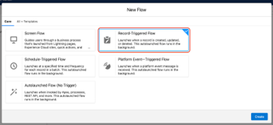
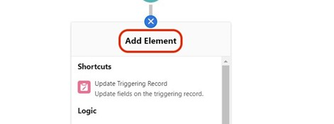
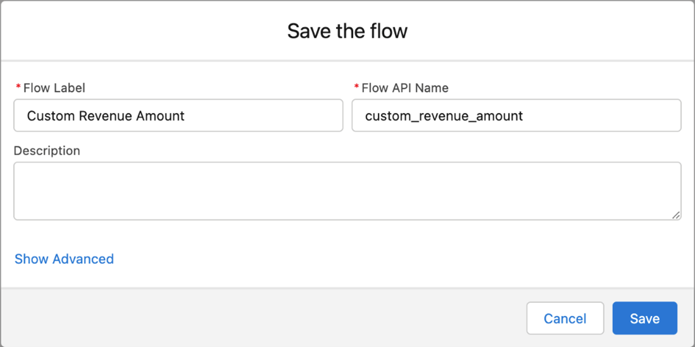
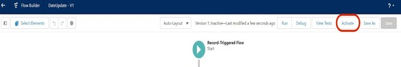
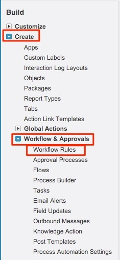

# 使用自訂收入金額欄位 {#using-a-custom-revenue-amount-field}

依預設，「購買者歸因接觸點」會從下列兩個欄位之一提取「商機金額」：

* 金額（SFDC預設值）
* [!DNL Marketo Measure] 機會金額（自訂）

如果您在您的「商機」上使用自訂「金額」欄位，我們將需要設定工作流程以計算「購買者接觸點收入」。 這需要一些更進階的知識 [!DNL Salesforce]，因此可能需要SFDC管理員的協助。

開始之前，我們需要以下資訊：

* 金額欄位的API名稱

從這裡，我們將開始建立工作流程。

## 在Salesforce Lightning中建立工作流程 {#create-the-workflow-in-salesforce-lightning}

以下步驟適用於Salesforce Lightning使用者。 如果您仍使用Salesforce Classic，這些步驟 [如下所列](#create-the-workflow-in-salesforce-classic).

1. 在「設定」中，在「快速尋找」方塊中輸入「流程」，然後選取 **[!UICONTROL Flows]** 以啟動流量產生器。 從右側面板按一下 **[!UICONTROL New Flow]** 按鈕。

   

1. 選取 **[!UICONTROL Record-Triggered Flow]** 並按一下 **[!UICONTROL Create]** 在右下角。

   

1. 在「設定開始」視窗中，選取Opportunity物件。 從 [!UICONTROL Configure Trigger] 區段，選取 **[!UICONTROL A record is created or updated]**.

   

1. 在「設定專案條件」區段的 [!UICONTROL Condition Requirements]，選取 **[!UICONTROL Custom Condition Logic Is Met]**.
   * 從搜尋欄位中，選取您的自訂金額欄位。
   * 將運運算元設為 **為Null**，則值如下 **[!UICONTROL False]**.
   * 將評估准則設為 **[!UICONTROL Every time a record is updated and meets the condition requirements]**.

   

1. 在「最佳化流量」區段下，選取 **[!UICONTROL Fast Field Updates]**. 按一下 **[!UICONTROL Done]** 在右下角。

   

1. 若要新增元素，請按一下加號(+)圖示並選取 **[!UICONTROL Update Triggering Record]**.

   

1. 在「新增更新記錄」視窗中，輸入下列內容：

   * 輸入標籤 — 將自動產生API名稱
   * 在「如何尋找記錄以更新並設定其值」下，選取 **[!UICONTROL Use the opportunity record that triggered the flow]**.
   * 在&quot;[!UICONTROL Set Filter Conditions]「部分，選擇 **[!UICONTROL Always Update Record]** 作為更新記錄的條件要求。
   * 在&quot;[!UICONTROL Set Field Values for the Campaign Record]，」從欄位選取Marketo Measure機會金額和來源值。 然後選取您的自訂金額欄位。
   * 按一下 **[!UICONTROL Done]**.

   

1. 按一下 **[!UICONTROL Save]**. 隨即顯示快顯視窗。 在「儲存流量」視窗中輸入「流量標籤」（會自動產生「流量API名稱」）。 按一下 **[!UICONTROL Save]** 再來一次。

   

1. 按一下 **[!UICONTROL Activate]** 按鈕以啟動流程。

   

## 在Salesforce Classic中建立工作流程 {#create-the-workflow-in-salesforce-classic}

以下步驟適用於Salesforce Classic使用者。 如果已切換至Salesforce Lightning，則這些步驟 [可在上方找到](#create-the-workflow-in-salesforce-lightning).

1. 瀏覽至 **[!UICONTROL Setup]** > **[!UICONTROL Create]** > **[!UICONTROL Workflow & Approvals]** > **[!UICONTROL Workflow Rules]**.

   

1. 選取 **[!UICONTROL New Rule]**，將物件設為「Opportunity」並按一下 **[!UICONTROL Next]**.

   

   

1. 設定工作流程。 將規則名稱設為「更新」 [!DNL Marketo Measure] 機會金額。」 將評估條件設為「已建立，且每次都進行編輯」。 在「規則條件」中，選取自訂「金額」欄位並選取「運運算元」 [!UICONTROL as "Not Equal To"] 並保留「值」欄位空白。

   

1. 新增工作流程動作。 將此挑選清單設為&quot;[!UICONTROL New Field Update].」
   

1. 您將在這裡填寫欄位資訊。 在「名稱」欄位中，我們建議使用此命名： &quot;[!DNL Marketo Measure] Opp金額。」 「唯一名稱」將會根據「名稱」欄位自動填入。 在「要更新的欄位」選擇清單中，選擇「[!DNL Marketo Measure] 機會金額。」 選取欄位後，選取「欄位變更後重新評估工作流程規則」方塊。 在「指定新欄位值」中，選取「使用公式來設定新值」。 在空白方塊中，拖放自訂金額欄位的API名稱。 按一下 **[!UICONTROL Save]**.

   

1. 系統會將您帶回工作流程的彙總頁面，請務必選取「啟動」，然後您就可以開始使用了。 若要啟動，請按一下 **[!UICONTROL Edit]** ，然後按一下 **[!UICONTROL Activate]**.

   完成這些步驟後，將必須更新機會，才能觸發工作流程以從取得新值 [!UICONTROL custom opportunity] 欄位。

   您可以透過SFDC內的Data Loader執行您的機會，來達成此目標。 尋找有關在中使用資料載入器的詳細資訊 [本文](/help/advanced-marketo-measure-features/custom-revenue-amount/using-data-loader-to-update-marketo-measure-custom-amount-field.md).

如果過程中有任何問題，請隨時聯絡Adobe客戶團隊（您的客戶經理）或 [[!DNL Marketo] 支援](https://nation.marketo.com/t5/support/ct-p/Support){target="_blank"}.
