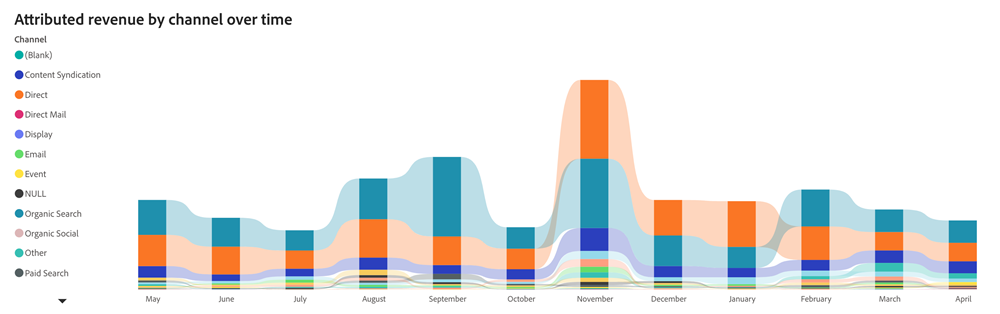
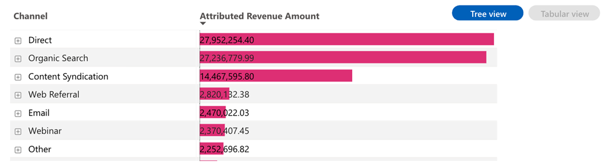
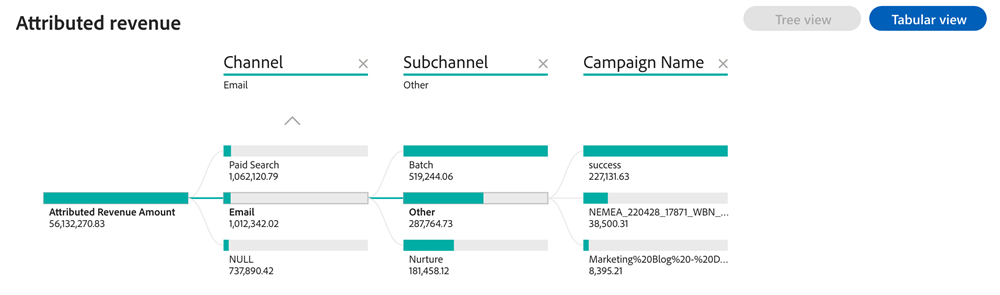

# 已歸因的收入儀表板 {#attributed-revenue-dashboard}

已歸因的收入儀表板提供與您的行銷活動直接相關的收入的焦點觀點。 探索您的行銷策略如何有助於達成交易。

>[!NOTE]
>
>此儀表板位於Beta中。 在此過渡階段中，目前和新的儀表板皆可存取。 在我們完全轉換並確保最佳功能後，目前的儀表板將被棄用。

**面板回答的問題**：

* 哪些管道、子管道或行銷活動在歸因收入方面排名最高？
* 我們歸因的收入總額與已歸因的已結束交易的計數是多少？

## 控制面板元件 {#dashboard-components}

### KPI動態磚 {#kpi-tiles}

* **已歸因的收入**：根據已選擇的歸因模型，來自具有接觸點的商機的收入貢獻總計。
* **已歸因的交易**：具有接觸點的「成功結案」商機數目。

### 依管道隨時間變化的已歸因收入圖表 {#attributed-revenue-by-channel-over-time-chart}

顯示每個月/季/年總歸因收入（依管道分段）的棧疊長條圖。

* 使用向下鑽研和向上功能來依月、季或年分類資料。
* 將滑鼠指標暫留在長條圖區段或長條圖之間的空白處，即可顯示詳細資訊。

**圖表回答的問題**：

* 哪些管道每季產生的收入最能歸因？
* 上個月依管道劃分的歸因收入分析為何？

### 已歸因的收入表格 {#attributed-revenue-table}

依管道、子管道和促銷活動劃分的總歸因收入，以表格和樹狀結構格式呈現。 按一下右上角的按鈕，在檢視之間切換。

**面板回答的問題**：

* 歸因的收入分配在管道內不同子管道之間有何差異？
* 特定子管道下的哪些行銷活動帶來最多歸因的收入？

**表格檢視**

* 表格檢視提供已歸因收入分佈的清晰且組織化的深入分析。 使用者可將資料分類至管道、子管道和行銷活動，以便快速辨識效能模式，並精確定位高影響力的行銷策略。
* 按一下每個管道旁的「+」圖示，即可顯示依子管道和促銷活動的劃分。

**樹狀檢視**

* 樹狀檢視可提供更具互動性和更精細的資料探索，讓行銷人員找出趨勢、異常或行銷工作中表現突出的表現。
* 按一下分支，以更深入地探究後續的階層圖層。

## 篩選窗格 {#filter-pane}

此儀表板配備了下列設定和篩選器：

* 日期（根據結束日期）
* 歸因模型
* 頻道、子頻道
* 行銷活動
* 區段

>[!MORELIKETHIS]
>
>* [探索儀表板基本資訊](/help/discover-dashboard-basics.md){target="_blank"}
>* [儀表板資料可見性原則](/help/dashboard-data-visibility-policy.md){target="_blank"}

