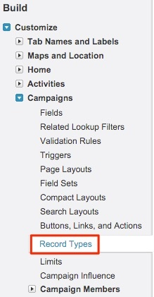
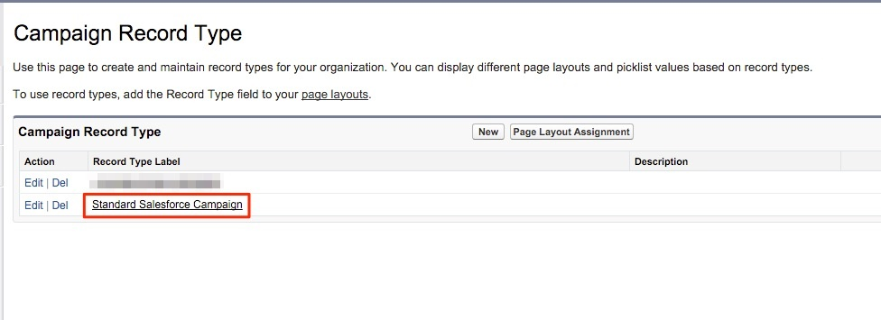
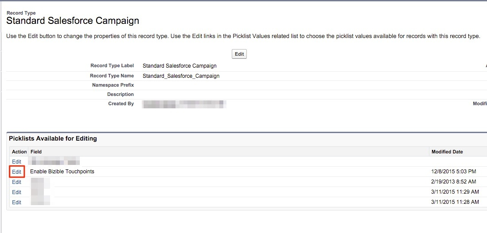
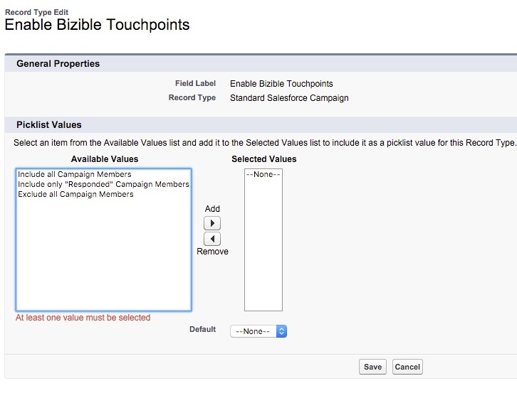

# 多種行銷活動記錄型別的設定 {#configurations-for-multiple-campaign-record-types}

**「啟用購買者接觸點」欄位中缺少挑選清單值**

如果您的SFDC組織使用多種促銷活動記錄型別，則必須為每個記錄型別新增「啟用購買者接觸點」的選擇清單值。 若要新增選項，請遵循下列步驟。

1. 前往「**[!UICONTROL Setup]** > **[!UICONTROL Customize]** > **[!UICONTROL Campaigns]** > **[!UICONTROL Record Types]**」。

   

1. 按一下&#x200B;**[!UICONTROL Record Type Label]**&#x200B;而非[!UICONTROL edit]按鈕，以選取行銷活動記錄型別。

   

1. 此時您會看到該記錄型別的可用選取清單。 選取「啟用購買者接觸點」欄位旁的&#x200B;**[!UICONTROL Edit]**。

   

1. 從「可用值」分組中新增所有三個值至「所選值」分組。

   

1. 將預設值設為「無」並按一下&#x200B;**[!UICONTROL Save]**。 對任何其他行銷活動記錄型別重複此步驟。
