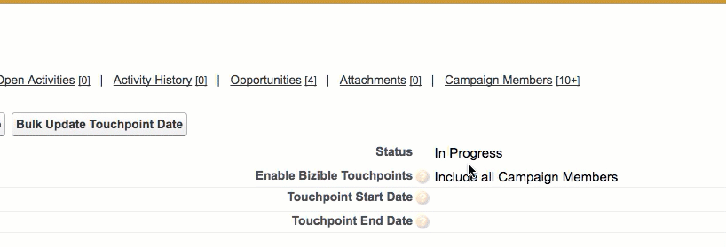

# Campaign同步日期 {#campaign-sync-dates}

瞭解Campaign同步日期功能的功能，並提供此功能的一些使用案例。

>[!NOTE]
>
>本文會介紹過時的程式。 我們鼓勵使用者使用[新的、改良的應用程式內程式](/help/channel-tracking-and-setup/offline-channels/custom-campaign-sync.md){target="_blank"}。

需要&#x200B;**[!DNL Marketo Measure]個套件： 6.9或更高**

此功能包含[!DNL Salesforce]促銷活動物件上的兩個簡單日期欄位：

* 接觸點開始日期
* 接觸點結束日期

在特定行銷活動上啟用購買者接觸點後，Campaign同步日期將允許您在個別行銷活動上設定接觸點日期引數。 因此，如果您要新增接觸點結束日期2017年3月1日，則[!DNL Marketo Measure]將只會在該日期之前新增至行銷活動的行銷活動成員上建立接觸點。 [!DNL Marketo Measure]不會為2017年3月1日之後新增的行銷活動成員建立接觸點。

同樣地，如果您要在行銷活動上新增接觸點開始日期（假設2017年1月1日），則[!DNL Marketo Measure]不會在2017年1月1日之前新增至行銷活動的行銷活動成員上建立接觸點。 如果您新增接觸點結束日期，則不需要新增接觸點開始日期，反之亦然。

## 使用案例 {#use-cases}

**回填接觸點**

行銷團隊有時可能會遺漏將utm引數新增到特定行銷工作。 行銷活動同步日期可讓您（如果您使用SFDC行銷活動進行線上工作）回填一些遺漏的資料。 假設您正在執行從5月1日開始的電子郵件促銷活動，但您的團隊直到5月15日才在該電子郵件促銷活動上新增utm引數。 如果您透過SFDC促銷活動追蹤電子郵件轉換，您可以將接觸點結束日期設為5月15日（該促銷活動）並啟用促銷活動「已回應」成員的接觸點。 此動作會指示[!DNL Marketo Measure]為截至5月15日的所有這些回應建立接觸點。

**回溯性行銷活動會籍接觸點**

如果您是[!DNL Marketo Measure]的新客戶，可能會想要帶來一些透過SFDC Campaigns追蹤的行銷資料。 不過，如果您要啟用線上SFDC行銷活動的接觸點，則可能會發生重複計算歸因的問題，因為[!DNL Marketo Measure]會自動建立您線上行銷活動的接觸點。 為避免重複計算資料，您可以使用Campaign接觸點結束日期，對[!DNL Marketo Measure]在SFDC行銷活動中建立的接觸點日期設定限制。 例如，如果您想要為您在SFDC中追蹤的Social促銷活動新增追溯轉換，但您瞭解您已在7月1日新增[!DNL Marketo Measure]個JavaScript （正在建立線上接觸點），則可以編輯Social SFDC促銷活動，使其包含等於7月1日的接觸點結束日期，並啟用該促銷活動的購買者接觸點。

接觸點結束日期可能有許多其他使用案例。 如果您需要協助瞭解特定情況，請隨時聯絡[Marketo支援](https://nation.marketo.com/t5/support/ct-p/Support){target="_blank"}。
