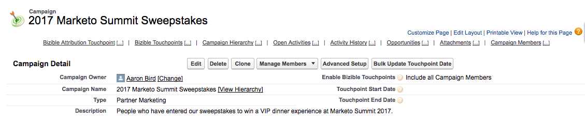

# 行銷活動和行銷活動成員 {#campaigns-and-campaign-members}

[!DNL Salesforce] 行銷活動旨在追蹤與行銷方案或活動相關聯的潛在客戶與聯絡人清單。 例如，這通常是網路研討會、註冊或兩次造訪。 行銷人員可選擇是否應在接觸點歷程中計入行銷活動。

>[!NOTE]
>
>本文會介紹過時的程式。 我們鼓勵使用者使用 [新的、改良的應用程式內程式](/help/channel-tracking-and-setup/offline-channels/custom-campaign-sync.md){target="_blank"}.

## 啟用接觸點 {#enabling-touchpoints}

此 [!DNL Marketo Measure] [!DNL Salesforce] 套件會在Campaign物件上包含標示為「啟用購買者接觸點」的欄位。 將欄位新增至頁面版面配置後，它會顯示為類似以下畫面：

挑選清單中可用的選項包括：

* 包含所有Campaign成員 — 新增至Campaign的每個單一Lead或Contact都會收到與該促銷活動相關聯的接觸點。
* 僅包括「已回應」行銷活動成員 — 只有行銷活動成員狀態為「已回應」的潛在客戶或聯絡人會收到與該行銷活動相關聯的接觸點。
* 排除所有行銷活動成員 — 沒有潛在客戶或聯絡人會收到與該行銷活動相關聯的接觸點。

請注意，行銷活動成員必須擁有與其記錄相關聯的電子郵件地址，才能 [!DNL Marketo Measure] 以建立接觸點。 如果沒有電子郵件地址， [!DNL Marketo Measure] 不會將接觸點指派給行銷活動成員。

## Campaign同步日期 {#campaign-sync-dates}

安裝套件後， [!DNL Marketo Measure] 也會在Campaign物件上包含2個日期欄位：接觸點開始日期和接觸點結束日期。

這些日期說明 [!DNL Marketo Measure] 何時應該開始或停止將來自行銷活動的行銷活動成員納入接觸點歷程。 您可以設定一個日期，或同時設定兩個日期，或完全不設定任何日期。

## 接觸點開始日期的使用案例 {#use-case-for-touchpoint-start-date}

開始日期可用於現有行銷活動用於追蹤銷售線索和聯絡人的情況，但使用者只想在新系統或流程到位後開始測量，因此他們決定設定開始日期一次 [!DNL Marketo Measure] 應該開始追蹤這些行銷活動成員。

## 接觸點結束日期的使用案例 {#use-case-for-touchpoint-end-date}

如果在使用之前 [!DNL Marketo Measure]，您使用行銷自動化平台來追蹤銷售機會的數位互動（IE表單提交），然後將這些銷售機會上傳至 [!DNL Saleforce] 促銷活動，您可以使用接觸點結束日期欄位。 您會使用將接觸點結束日期設定為開始日期 [!DNL Marketo Measure] 並啟用「購買者接觸點」，則每個銷售機會的數位互動都會建立為接觸點。 您使用將接觸點結束日期設定為開始日期的原因 [!DNL Marketo Measure] 這是因為，往後，我們會透過javascript追蹤這些數位互動。

## 行銷活動成員 {#campaign-members}

促銷活動成員巢狀位於 [!UICONTROL Campaigns]，和和銷售機會或聯絡人有關。 銷售機會或聯絡人只能新增至行銷活動一次，這可能會根據Campaign的使用案例產生問題。 同步促銷活動時，促銷活動會將其成員資格用作行銷活動，置於接觸點歷程中，並被視為表單填入。

## 購買者接觸點狀態 {#buyer-touchpoint-status}

如果已啟用， [!DNL Marketo Measure] 會經由4個包含在已安裝套件中的不同欄位，將狀態值推送至促銷活動成員：接觸點狀態（銷售機會）、接觸點狀態（聯絡人）、接觸點狀態（商機）及接觸點狀態日期。 這有助於客戶稽核是否已將接觸點建立為「購買者接觸點」或「購買者歸因接觸點」，具體取決於其相關的物件。 接觸點狀態日期只是促銷活動成員上狀態更新的最後日期。

## 購買者接觸點日期 {#buyer-touchpoint-date}

安裝套件後， [!DNL Marketo Measure] 也包含行銷活動會員上標示為「購買者接觸點日期」的欄位。 這可讓使用者覆寫日期 [!DNL Marketo Measure] 會使用作為接觸點記錄上的接觸點日期。

如果清單是在實際發生事件後的數天/數週/數月上傳的，則可能必須執行此操作。 有多種方式可一次更新所有記錄，如下所述。

為了知道您是否需使用「購買者接觸點日期」，以下是如何決定日期的 [!DNL Marketo Measure] 依據 [!UICONTROL Sync Type] 已針對Campaign選取的專案。

如果 [!UICONTROL Sync Type] 設為「包含所有促銷活動成員」，設定接觸點日期的優先順序是從上到下：

* 購買者接觸點日期
* 促銷活動會員建立日期

如果 [!UICONTROL Sync Type] 設為「僅包含&#39;已回應&#39;的行銷活動成員」，設定接觸點日期的優先順序是從上到下：

* 購買者接觸點日期
* 第一個回應日期
   * 當狀態變更為「已回應」且為標準時，會自動設定第一個回應日期 [!DNL Salesforce] 無法變更的欄位

* 促銷活動會員建立日期

## 大量更新接觸點日期 {#bulk-update-touchpoint-date}

大量更新接觸點日期包含在已安裝的中 [!DNL Marketo Measure] [!DNL Salesforce] 套件和按鈕需要新增到頁面配置。

如果需要更新大量行銷活動會員記錄，您可以使用 [!UICONTROL Bulk Update Touchpoint Date] 按鈕以大量編輯。

如果此介面不包含獨特的使用案例，您也可以使用 [資料載入器](https://dataloader.io/){target="_blank"} 若要匯出記錄，請進行變更，然後將這些記錄上傳回。

首先，搜尋記錄並篩選您要為其設定「購買者接觸點」日期的記錄。

>[!CAUTION]
>
>有一個搜尋無法運作，如下面的範例所示。 UI不支援搜尋null購買者接觸點日期（以下搜尋無法運作）：

如果您不需要使用搜尋，只要將日期套用至每個促銷活動成員記錄即可，請使用&quot;[!UICONTROL Include All Records]「核取方塊（請參閱底下的熒幕擷圖），此核取方塊會檢查所有頁面上的所有記錄。

從行事曆選擇器選取日期和時間。 如果您要選取目前的日期和時間，請按一下行事曆選擇器旁邊顯示的日期/時間。

日期與時間設定完成後，按一下 **[!UICONTROL Update Selected Records]** 按鈕以套用變更。

## 行銷活動成本 {#campaign-costs}

瞭解所有促銷活動成本 [本文章](/help/marketing-spend/spend-management/crm-campaign-costs.md){target="_blank"}.

## 行銷活動成員移除 {#campaign-member-removal}

方法如下 [!DNL Marketo Measure] 會與Salesforce中的任何已刪除記錄保持同步，無論這些記錄是已刪除銷售機會、帳戶還是商機，都會在API中檢視這些記錄並追蹤專案是否標示為「IsDeleted」。 不幸的是，對於行銷活動成員，Salesforce採用了不同的方式從行銷活動中刪除這些行銷活動成員，這些成員實際上標籤為「已移除」而非「已刪除」，因此問題為接觸點仍然存在於Salesforce中與已刪除行銷活動成員相關的部分。

若要解決此問題， [!DNL Marketo Measure] 已建立 [!DNL Marketo Measure] 歷史記錄物件與觸發器，每當移除促銷活動成員時就會加以追蹤，然後刪除對應的接觸點。 **您將需要 [!DNL Marketo Measure] Marketing Analytics套件6.15版或更新版本** 以使用此功能。

>[!CAUTION]
>
>請記住，此觸發器不會追蹤過去移除的任何行銷活動成員，因此這僅適用於未來工作。 如果您需要移除大量過去行銷活動成員的接觸點，請聯絡 [Marketo支援](https://nation.marketo.com/t5/support/ct-p/Support){target="_blank"}.

>[!MORELIKETHIS]
>
>[[!DNL Marketo Measure] Tutorials：促銷活動物件欄位](https://experienceleague.adobe.com/en/docs/marketo-measure-learn/tutorials/onboarding/marketo-measure-salesforce/campaign-object-fields){target="_blank"}
>
>[[!DNL Marketo Measure] Tutorials：對應離線頻道](https://experienceleague.adobe.com/en/docs/marketo-measure-learn/tutorials/onboarding/marketo-measure-salesforce/mapping-offline-channels){target="_blank"}
