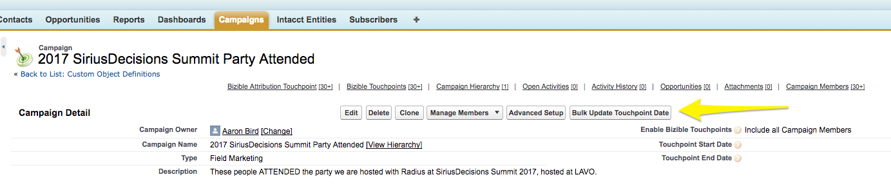

# 同步離線行銷活動 {#syncing-offline-campaigns}

準確地追蹤離線行銷活動，並瞭解其與您數位行銷工作的比較情形，可能相當困難。 [!DNL Marketo Measure]可讓您在[!DNL Salesforce]中追蹤並歸因您的離線行銷活動，即使在事件幾週後才會建立[!DNL Salesforce]行銷活動的情況下亦然。

>[!NOTE]
>
>本文會介紹過時的程式。 我們鼓勵使用者使用[新的、改良的應用程式內程式](/help/channel-tracking-and-setup/offline-channels/custom-campaign-sync.md){target="_blank"}。

## 同步之前 {#before-you-sync}

以下是有效率同步程式的一些秘訣：

* 離線行銷活動是指不會線上上發生的行銷互動。 其中包括行銷管道，例如活動、網路研討會及商展。 僅包含離線行銷活動。
* 如果您想要納入在您安裝[!DNL Marketo Measure]之前追蹤線上活動的行銷活動，請務必將接觸點結束日期設定為您網站上部署我們JavaScript的日期。
* 讓[!DNL Marketo Measure]應用程式在離線管道頁面上保持開啟會很有幫助，這樣就能輕鬆識別不同的促銷活動型別，以及接觸點要分組到的行銷管道。

* 按下&quot;[!UICONTROL Save]&quot;按鈕前仔細檢查所有專案！

## 大量更新接觸點日期 {#bulk-update-touchpoint-date}

在[!DNL Salesforce]中，促銷活動成員物件上的建立日期欄位會記下促銷活動成員新增至促銷活動的日期。 為了讓同步程式順利進行，請確定「Buyer Touchpoint日期」欄位的日期與「Salesforce促銷活動成員物件」上的日期相同。 此步驟是使用&#x200B;_之前_&#x200B;的「[!UICONTROL Bulk Update Touchpoint Date button]」執行，您在「啟用購買者接觸點」欄位中選取[!UICONTROL picklist]選項。

為什麼這很重要？ 想像一下，您的公司在1月的一次會議上贊助了一個展位。 在大會中，有100個人對您的產品表示興趣，並提供他們的連絡資訊以接收電子郵件更新。 三週後，您終於在[!DNL Salesforce]中建立了行銷活動以追蹤會議結果。

您的上傳日期會晚於會議日期三週。 若要修正此差異，可以使用[!UICONTROL Bulk Update Touchpoint Date]按鈕來設定適當的日期。 按鈕如下圖所示。

在這種情況下，上傳日期會回填三週。 此步驟應在設定&quot;[!UICONTROL Enable Buyer Touchpoints]&quot;欄位之前完成。

總而言之，如果您使用「[!UICONTROL Bulk Update Touchpoint Date]」按鈕並將接觸點日期變更為事件日期，[!DNL Marketo Measure]將會針對事件的實際日期（而非上傳日期）產生接觸點。

您也可以更新現有行銷活動上所有行銷活動成員的日期。 這樣做時，請確定接觸點的日期是成員互動的日期。 按一下「大量更新Buyer Touchpoint日期」，視情況篩選促銷活動成員清單，並在促銷活動成員清單上方的&quot;[!UICONTROL Select Date]&quot;選項中，新增與事件發生日期相同的日期。

>[!CAUTION]
>
>請務必在&#x200B;_之前更新接觸點日期_&#x200B;為所有行銷活動成員啟用接觸點。

## 如何建立行銷活動並同步購買者接觸點 {#how-to-create-a-campaign-and-sync-buyer-touchpoints}

若要在[!DNL Salesforce]中建立行銷活動，請導覽至[!UICONTROL Campaigns]索引標籤並選取&#39;[!UICONTROL New]&#39;，如下圖所示。 視您的[!DNL Salesforce]設定而定，您可能需要按一下加號(+)圖示，將行銷活動新增至頂端列。

建立此行銷活動時，按一下「[!UICONTROL Enable Buyer Touchpoints]」欄位，然後從選擇清單中選取下列其中一個選項：

* **包含所有行銷活動成員**
   * 此選項可讓[!DNL Marketo Measure]將接觸點歸因於每個行銷活動成員。

* **包含「已回應」的行銷活動成員。**
   * 此選項會將接觸點套用至狀態為「已回應」的行銷活動成員。

* **排除所有行銷活動成員。**
   * 此選項不會將接觸點歸因於行銷活動中的任何成員，且會作為刻意將行銷活動從[!DNL Marketo Measure]中排除的標幟。 如果您曾經在意外情況下將促銷活動與購買者接觸點同步，您可以將狀態變更為「排除所有促銷活動成員」，且接觸點將會移除。

一旦選擇其中一個選項，[!DNL Marketo Measure]就會將接觸點指派給每個行銷活動成員（若適用）。 新增至行銷活動&#x200B;_的銷售機會或聯絡人必須_&#x200B;擁有與其記錄關聯的電子郵件地址，才能讓[!DNL Marketo Measure]建立接觸點。 若沒有電子郵件地址，[!DNL Marketo Measure]就不會將接觸點指派給行銷活動成員。

>[!MORELIKETHIS]
>
>[[!DNL Marketo Measure] Tutorials：對應離線頻道](https://experienceleague.adobe.com/en/docs/marketo-measure-learn/tutorials/onboarding/marketo-measure-salesforce/mapping-offline-channels){target="_blank"}
>
>[[!DNL Marketo Measure] Tutorials： Campaign物件欄位](https://experienceleague.adobe.com/en/docs/marketo-measure-learn/tutorials/onboarding/marketo-measure-salesforce/campaign-object-fields){target="_blank"}
