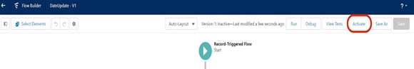
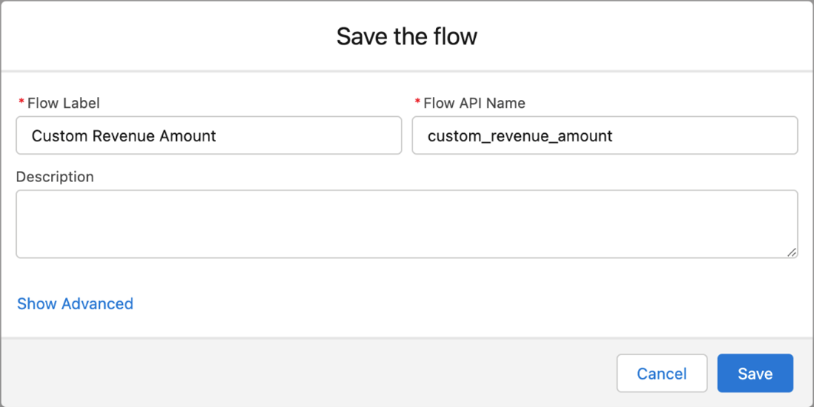
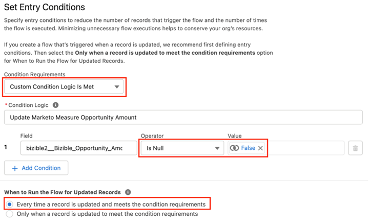
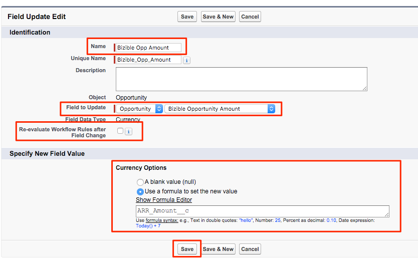
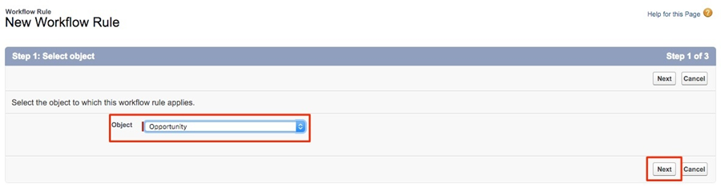
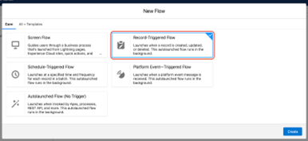
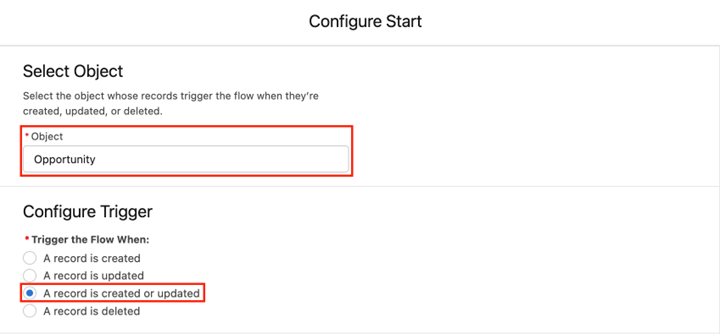
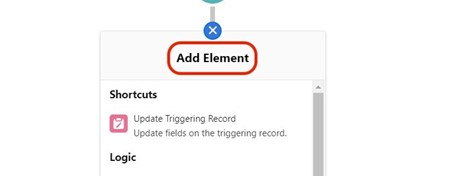

# 使用自訂收入金額欄位 {#using-a-custom-revenue-amount-field}

依預設，「購買者歸因接觸點」會從下列兩個欄位之一提取「商機金額」：

* 金額(SFDC預設)
* [!DNL Marketo Measure]機會金額（自訂）

如果您在您的Opportunities上使用自訂「金額」欄位，則需要設定工作流程以計算Buyer Touchpoint收入。 這需要[!DNL Salesforce]的進階知識，因此可能需要您的SFDC管理員協助。

開始之前，我們需要以下資訊：

* 金額欄位的API名稱

從這裡，我們將開始建立工作流程。

## 在Salesforce Lightning中建立工作流程 {#create-the-workflow-in-salesforce-lightning}

以下步驟適用於Salesforce Lightning使用者。 如果您仍使用Salesforce Classic，這些步驟[將列在下方](#create-the-workflow-in-salesforce-classic)。

1. 從[設定]中，在[快速尋找]方塊中輸入[流量]，然後選取&#x200B;**[!UICONTROL Flows]**&#x200B;以啟動[流量產生器]。 從右側面板按一下&#x200B;**[!UICONTROL New Flow]**&#x200B;按鈕。

   ![1. 在[設定]中，在[快速尋找]方塊中輸入[流程]，然後選取](assets/custom-amount-1.png)

1. 選取&#x200B;**[!UICONTROL Record-Triggered Flow]**&#x200B;並按一下右下角的&#x200B;**[!UICONTROL Create]**。

   ![1. 選取記錄觸發的流量，然後按一下底部的[建立] ](assets/custom-amount-10.png)

1. 在「設定開始」視窗中，選取Opportunity物件。 從[!UICONTROL Configure Trigger]區段中，選取&#x200B;**[!UICONTROL A record is created or updated]**。

   

1. 在「設定專案條件」區段的[!UICONTROL Condition Requirements]下，選取&#x200B;**[!UICONTROL Custom Condition Logic Is Met]**。
   * 從搜尋欄位中，選取您的自訂金額欄位。
   * 將運運算元設為&#x200B;**Is Null**，並將值設為&#x200B;**[!UICONTROL False]**。
   * 將評估准則設定為&#x200B;**[!UICONTROL Every time a record is updated and meets the condition requirements]**。

   ![將評估條件設定為[每次更新記錄時]](assets/custom-amount-12.png)

1. 在「最佳化流量」區段下，選取&#x200B;**[!UICONTROL Fast Field Updates]**。 按一下右下方的&#x200B;**[!UICONTROL Done]**。

   」

1. 若要新增元素，請按一下加號(+)圖示並選取&#x200B;**[!UICONTROL Update Triggering Record]**。

   

1. 在「新增更新記錄」視窗中，輸入下列內容：

   * 輸入標籤 — 將自動產生API名稱
   * 在[如何尋找記錄以更新並設定其值]下，選取&#x200B;**[!UICONTROL Use the opportunity record that triggered the flow]**。
   * 在&quot;[!UICONTROL Set Filter Conditions]&quot;區段中，選取&#x200B;**[!UICONTROL Always Update Record]**&#x200B;作為更新記錄的條件需求。
   * 在&quot;[!UICONTROL Set Field Values for the Campaign Record]&quot;中，從欄位選取Marketo Measure機會金額和來源值。 然後選取您的自訂金額欄位。
   * 按一下「**[!UICONTROL Done]**」。

   ![按一下[完成]。](assets/custom-amount-15.png)

1. 按一下「**[!UICONTROL Save]**」。 隨即顯示快顯視窗。 在「儲存流量」視窗中輸入「流量標籤」（會自動產生「流量API名稱」）。 再按一下&#x200B;**[!UICONTROL Save]**。

   中輸入「流程標籤」

1. 按一下&#x200B;**[!UICONTROL Activate]**&#x200B;按鈕以啟動流程。

   ![1. 按一下[啟動]按鈕以啟動流程。](assets/custom-amount-3.png)

## 在Salesforce Classic中建立工作流程 {#create-the-workflow-in-salesforce-classic}

下列步驟適用於Salesforce Classic使用者。 如果您已切換至Salesforce Lightning，這些步驟[可在上找到](#create-the-workflow-in-salesforce-lightning)。

1. 導覽至&#x200B;**[!UICONTROL Setup]** > **[!UICONTROL Create]** > **[!UICONTROL Workflow & Approvals]** > **[!UICONTROL Workflow Rules]**。

   

1. 選取&#x200B;**[!UICONTROL New Rule]**，將物件設為[商機]，然後按一下&#x200B;**[!UICONTROL Next]**。

   ![1. 選取[新增規則]，將物件設為[商機]並按一下](assets/custom-amount-5.png)

   ![1. 選取[新增規則]，將物件設為[商機]並按一下](assets/custom-amount-6.png)

1. 設定工作流程。 將規則名稱設為「更新[!DNL Marketo Measure]機會金額」。 將評估條件設為「已建立，且每次都進行編輯」。 對於「規則條件」，請選取您的自訂「金額」欄位，然後選取運運算元[!UICONTROL as "Not Equal To"]，並將「值」欄位保留空白。

   」

1. 新增工作流程動作。 將此挑選清單設為&quot;[!UICONTROL New Field Update]&quot;。
   ]

1. 您將在這裡填寫欄位資訊。 在「名稱」欄位中，我們建議使用此命名：「[!DNL Marketo Measure] Opp數量」。 「唯一名稱」將會根據「名稱」欄位自動填入。 在「要更新的欄位」選擇清單中，選取「[!DNL Marketo Measure]機會金額」。 選取欄位後，選取「欄位變更後重新評估工作流程規則」方塊。 在「指定新欄位值」中，選取「使用公式來設定新值」。 在空白方塊中，拖放自訂金額欄位的API名稱。 按一下「**[!UICONTROL Save]**」。

   

1. 系統會將您帶回工作流程的彙總頁面，請務必選取「啟動」，然後您就可以開始使用了。 若要啟用，請按一下新工作流程旁的&#x200B;**[!UICONTROL Edit]**，然後按一下&#x200B;**[!UICONTROL Activate]**。

   完成這些步驟後，需要更新機會，才能觸發工作流程從[!UICONTROL custom opportunity]欄位取得新值。

   您可以透過SFDC中的資料載入器執行您的機會，藉此達成上述目標。 在[本文章](/help/channel-tracking-and-setup/using-data-loader-to-update-marketo-measure-custom-amount-field.md)中尋找有關使用資料載入器的詳細資料。

如果過程中有任何問題，請隨時聯絡Adobe客戶團隊（您的客戶經理）或[[!DNL Marketo] 支援](https://nation.marketo.com/t5/support/ct-p/Support){target="_blank"}。
