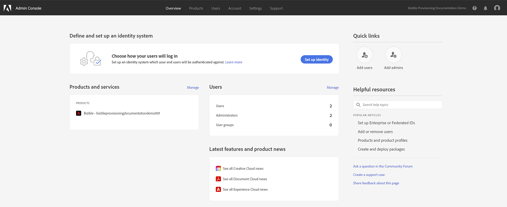
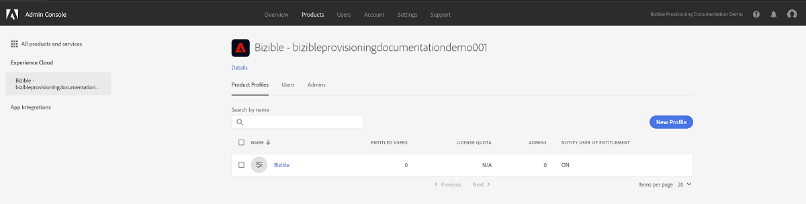

# Adobe Admin Console設定 {#adobe-admin-console-setup}

使用[!DNL Marketo Measure]的第一步是建立並登入您已布建的Adobe Admin Console。 如果您尚未收到包含登入指示的電子郵件，請聯絡您的[!DNL Marketo Measure]客戶代表。

## 設定您的Adobe Admin Console和身分提供者 {#set-up-your-adobe-admin-console-and-identity-provider}

作為Adobe套裝中的產品，[!DNL Marketo Measure]使用適用於Identity Management的Adobe Admin Console的完整功能。 更多資源可在[這裡](https://helpx.adobe.com/tw/enterprise/using/admin-console.html)找到。

建議您檢閱可用於[Identity Management](https://helpx.adobe.com/tw/enterprise/using/set-up-identity.html)的資源、最佳實務和選項。

如需在Adobe Admin Console中設定Identity Management的指引和檢閱，請聯絡您的[!DNL Marketo Measure]客戶代表。

為方便您的[!DNL Marketo Measure]執行個體進行使用者驗證和授權，Adobe Admin Console中需要下列步驟：

**設定[!DNL Marketo Measure]產品卡**

存取Adobe Admin Console後，您會在「概觀」區段中看到您的[!DNL Marketo Measure]產品執行個體。

按一下「[!DNL Marketo Measure]」產品卡片會顯示您所有的[!DNL Marketo Measure]執行個體。 依預設，每個[!DNL Marketo Measure]執行個體都有自己的設定檔，前置詞為&#39;[!DNL Marketo Measure]&#39;。 任何新增至此或此執行個體中任何其他設定檔的管理員或使用者都可以登入[!DNL Marketo Measure]。

在[!DNL Marketo Measure]產品執行個體中建立設定檔不需要任何動作。

若要開始新增可以存取[!DNL Marketo Measure]的使用者，請參閱下方的[新增 [!DNL Marketo Measure] 管理員和 [!DNL Marketo Measure] 使用者](#adding-marketo-measure-admins-and-marketo-measure-users)區段。

## 正在新增[!DNL Marketo Measure]位管理員和[!DNL Marketo Measure]位使用者 {#adding-marketo-measure-admins-and-marketo-measure-users}

下一步是新增使用者，以授與[!DNL Marketo Measure]應用程式的存取權。 您可以在[!DNL Marketo Measure]產品卡的admin和users目錄中完成此作業。

| 使用者型別 | 說明 |
|---|---|
| 管理員 | 這些是[!DNL Marketo Measure]應用程式的管理員和進階使用者，具有更新和管理[!DNL Marketo Measure]特定組態選項的完整能力 |
| 使用者 | 這些是[!DNL Marketo Measure]應用程式的標準使用者，在[!DNL Marketo Measure]應用程式內具有唯讀許可權 |

將使用者新增至其個別群組時，您會看到列出其[身分型別](https://helpx.adobe.com/tw/enterprise/using/set-up-identity.html)。

>[!NOTE]
>
>若要成為[!DNL Marketo Measure]管理員(位於[experience.adobe.com/marketo-measure](https://experience.adobe.com/marketo-measure){target="_blank"})，使用者必須新增為使用者&#x200B;_和_ [!DNL Marketo Measure]產品卡中任何[!DNL Marketo Measure]產品設定檔的管理員。

**正在登入[!DNL Marketo Measure]**

將使用者新增至產品設定檔後，他們便能在[!DNL Marketo Measure]experience.adobe.com/marketo-measure **中選擇**&#x200B;使用Adobe ID登入[選項來存取其](https://experience.adobe.com/marketo-measure){target="_blank"}執行個體。

