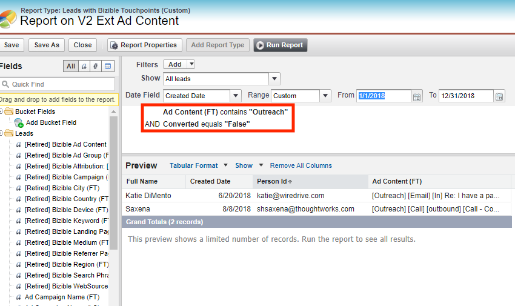

# [!DNL Salesforce] 包整合 {#salesforce-package-consolidation}

我們很高興宣佈即將對Marketo Measure Salesforce套件進行更改。 為了增強用戶體驗並簡化使用，我們將所有現有軟體包整合到單一、全面的軟體包中。

## 包報廢 {#package-retirement}

由於此整合，當前的V1 、 V2_EXT 、 V2_Security和所有報告包都將在2023年8月之後淘汰。 如果已安裝V2軟體包，則必須將其更新到新的整合版本。

## 新整合包 {#new-consolidated-package}

新的整合V2包整合了以前包的所有功能和特性，提供了改進的用戶體驗。 此更新的套件可讓行銷和銷售績效追蹤更有效率，並可讓客戶行為獲得更深入的分析。

## 支援與轉換 {#support-and-transition}

我們了解，這項變更可能需要調整，我們承諾在整個過程中為您提供支援。 我們的 [支援團隊](https://nation.marketo.com/t5/support/ct-p/Support){target="_blank"} 可隨時回答任何問題，並協助確保順利過渡到新的整合包。

## 必要動作 {#retired-actions}

* 如果已安裝V2軟體包，則必須將其更新到新的整合版本。
* 如果您有來自任何報表套件的報表或控制面板，則無需任何修改即可輕鬆重新建立報表或控制面板，因為整合套件中使用的所有欄位皆已存在。
* 如果您有使用V2_EXT包中欄位的報告，則可以通過以下步驟在統一包中重新建立它們：
   * V2_EXT欄位中的所有資料都可在接觸點欄位中使用，因此您可以修改報表，在接觸點位置上新增篩選器，以從對應的V2接觸點欄位擷取資料。
   * 以包含「外聯」文字的「廣告內容FT」擷取所有銷售機會的範例報表。
      * V2_EXT查詢：
         * bizible2_ext__Ad_Content_FT__c包含外聯

* 統一包中的對應查詢：
   * bizible2__Touchpoint_Position__c包含FT和
   * bizible2__Ad_Content__c包含外聯

## 常見問題集 {#faq}

**整合的包是否與我現有包中的欄位衝突？**

安裝整合套件之前，您不需要先解除安裝套件。 欄位中不會有衝突，因為這些欄位會位於不同的命名空間中。

**如何回填目前套件的資料？**

您可以提交票證 [支援](https://nation.marketo.com/t5/support/ct-p/Support){target="_blank"} 用於回填和重新處理BT/BAT資料，以填入「接觸點ID」和「表單ID」欄位。

**V1和V2_EXT包中的欄位是否可在整合包中使用？**

是. 整合套件將包含V1中的相同欄位，並透過接觸點欄位依物件和V2_EXT欄位進行進一步劃分。

**可以在統一包中重新建立使用V2_EXT欄位的報告嗎？**

是. 請依照 [必要動作](#retired-actions) 一節。
