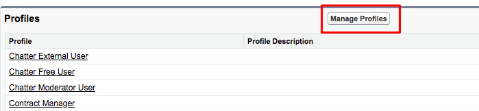

# [!DNL Marketo Measure]深入分析設定 {#marketo-measure-insights-configuration}

[!DNL Marketo Measure]前瞻分析畫布應用程式應新增至潛在客戶頁面配置，但需要在[!DNL Salesforce]設定的「連線應用程式」區段中進行額外設定。 請依照這些指示，確保Canvas App擁有適當的許可權。

1. 瀏覽至「[!DNL Salesforce]安裝程式」，然後按一下「[!UICONTROL Manage Apps]」標籤下的「**[!UICONTROL Connected Apps]**」。

1. 從填入的清單中選取[!DNL Marketo Measure Insights]。

1. 在[!UICONTROL OAuth]原則區段下，將「允許的使用者」設定變更為「管理員核准的使用者已預先授權」。 出現快顯視窗，按一下&#x200B;**[!UICONTROL OK]**，然後按&#x200B;**[!UICONTROL Save]**。

   

1. 儲存頁面後，您就可以按一下&#x200B;**[!UICONTROL Manage Profiles]**&#x200B;按鈕。

   

1. 選取所有應能存取[!DNL Marketo Measure]深入分析的設定檔，然後按一下&#x200B;**[!UICONTROL Save]**。
