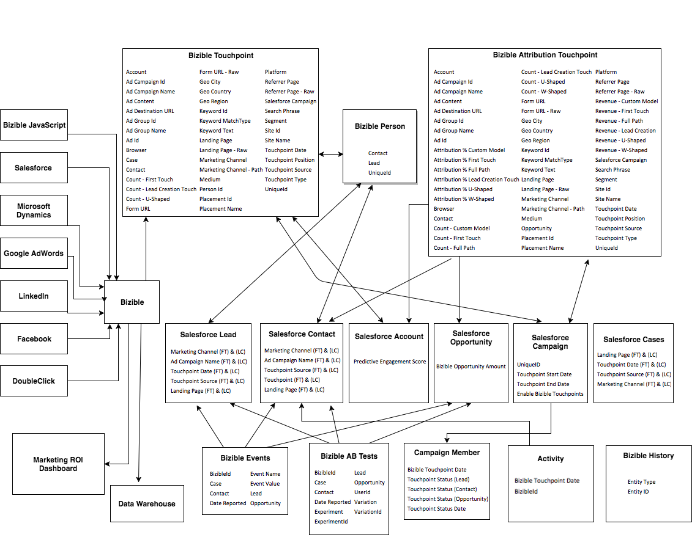

# [!DNL Marketo Measure]物件與欄位分類法 {#marketo-measure-object-and-field-taxonomy}

以下是一個流程圖，代表[!DNL Marketo Measure]自訂物件與[!DNL Salesforce]標準物件的關係。

如需完整大小的影像，[請按一下這裡](assets/bizible-full-1.png)。

每個物件[!DNL Marketo Measure]中的[欄位定義可在此找到](/help/glossary.md)。

## 常見問題 {#faq}

**箭號中的邏輯為何？**

每個箭頭都描述物件與另一個物件之間的關係。 例如，您會看到[!DNL Marketo Measure]人員填入標準[!DNL Salesforce]潛在客戶物件的欄位。 如果指向它，則表示它填入箭頭的接收端。

**什麼是[!DNL Marketo Measure]人員？**

這是[!DNL Marketo Measure]中的自訂[!DNL Salesforce]物件，可將購買者接觸點連結至潛在客戶與聯絡人。

**什麼是[!DNL Bizible].JS？**

這是我們用來追蹤個人在特定網站上所擁有之網頁資訊的自訂JavaScript。

**什麼是行銷ROI儀表板？**

這是生活在[!DNL Marketo Measure]應用程式中的自訂行銷管道儀表板。 您可以前往[!DNL Marketo Measure]中的[!DNL Salesforce]索引標籤來存取它。
