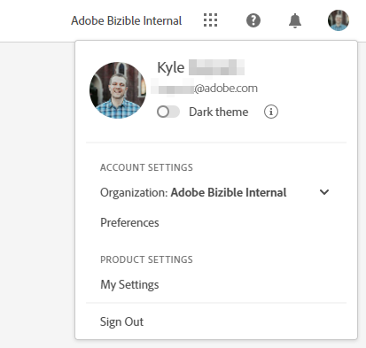

# Adobe Experience Cloud 介面概觀 {#experience-cloud-interface-overview}

Adobe Experience Cloud介面可協調Adobe Experience Cloud應用程式和服務的外觀和風格。 但是其並不只是新設計而已。 這是一款單頁應用程式，能在單一執行個體中提供使用者體驗。

## 使用者流程 {#user-flow}

如果您已登入Adobe Experience Cloud產品，請按一下功能表圖示並選取&#x200B;**[!DNL Marketo Measure]**。

>[!NOTE]
>
>您的下拉式功能表可能會根據您訂閱的Adobe Experience Cloud產品而有所不同。

如果您&#x200B;_尚未_&#x200B;登入Adobe Experience Cloud產品，請直接登入這裡： [https://experience.adobe.com/marketo-measure](https://experience.adobe.com/marketo-measure)的[!DNL Marketo Measure]。

## 新功能 {#new-features}

除了已更新的外觀和風格，請注意下列功能：

**網域管理**

[管理您的 [!DNL Marketo Measure] 網域](/help/marketo-measure-and-adobe/domain-management.md)，不需要[!DNL Marketo Measure]的協助。

**整合式說明中心**

搜尋支援文章、提交票證、提供意見回饋，所有這些都是從[!DNL Marketo Measure]應用程式中進行。

**應用程式切換器**

能夠存取多個Adobe產品的使用者可在兩者之間輕鬆切換。

**通知和公告**

直接在應用程式中檢視產品特定通知和一般 Adobe 產品公告，並進行互動。

**Adobe 設定**

若要變更您的語言或其他Adobe偏好設定，請按一下您的個人資料圖示。 您也可以按一下&#x200B;**我的設定**，進行[!DNL Marketo Measure]特定的變更。

## 常見問題集 {#faq}

**我的書籤有什麼改變？**

書籤會被重新導向。 例如，如果您要導覽至https://apps.marketo-measure.com/Discover/391 ，您將在完成驗證後重新導向至https://experience.adobe.com/marketo-measure/Discover/391 。

**我無法透過Experience Cloud介面登入[!DNL Marketo Measure]。 可能是什麼問題造成？**

如果您可登入Adobe Experience Cloud，但看到類似以下頁面，則問題可能在[!DNL Marketo Measure]端：

如果您收到上述錯誤，[請連絡支援](https://nation.marketo.com/t5/support/ct-p/Support)以取得協助。
