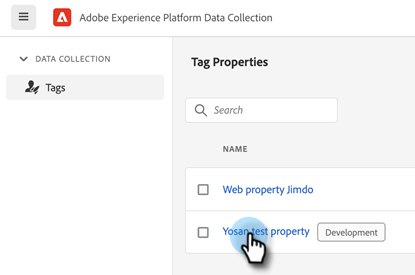
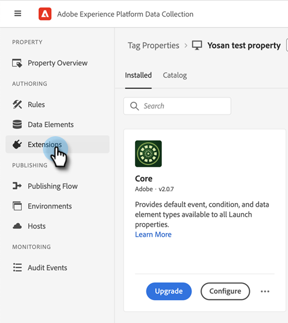
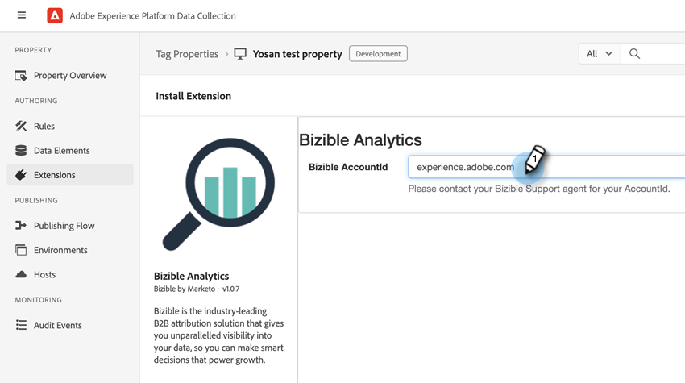
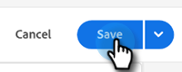
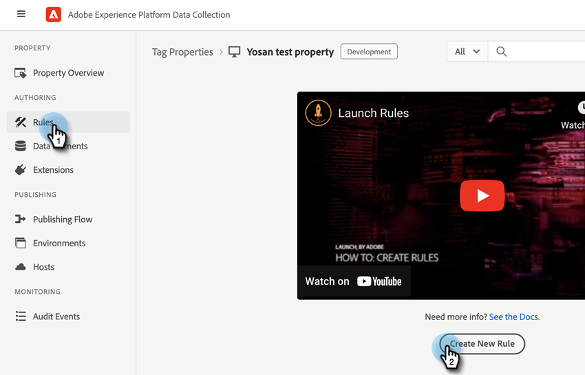
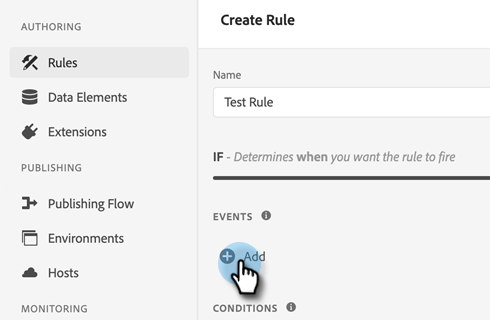
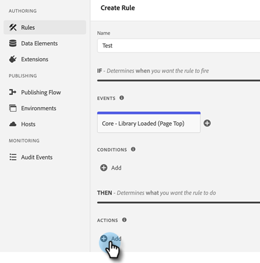
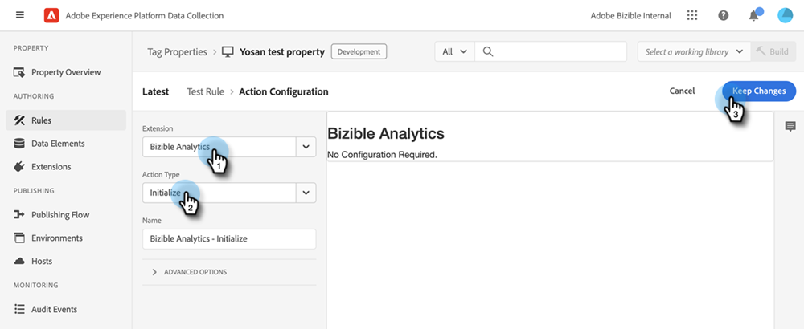
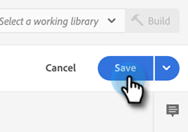

# [!DNL Marketo Measure]與Adobe Launch的整合 {#marketo-measure-integrations-with-adobe-launch}

Adobe Launch擴充功能是專為已在網站上使用Adobe Launch的現有[!DNL Marketo Measure]使用者所設計。 擴充功能可作為標籤管理解決方案，用於根據特定事件和條件設定及動態載入頁面上的指令碼。

在Adobe Launch中安裝並設定後，[!DNL Marketo Measure]擴充功能會在有Adobe Launch指令碼的頁面上載入bizible.js指令碼。 這可讓行銷人員透過Adobe Launch設定新增bizible.js，而非明確修改網頁以新增bizible.js指令碼標籤。

## 設定Adobe Launch擴充功能 {#configure-the-adobe-launch-extension}

>[!PREREQUISITES]
>
>請參閱下列連結，深入瞭解Adobe Launch及其擴充功能：
>
>* [[!DNL Marketo Measure] 副檔名](https://experienceleague.adobe.com/docs/experience-platform/destinations/catalog/email/bizible.html#catalog){target="_blank"}
>* [Adobe啟動概述](https://experienceleague.adobe.com/docs/platform-learn/implement-in-websites/overview.html){target="_blank"}
>* [Adobe Launch擴充功能概觀](https://experienceleague.adobe.com/docs/experience-platform/tags/extension-dev/overview.html){target="_blank"}

1. 依照本文[&#128279;](https://experienceleague.adobe.com/docs/platform-learn/implement-in-websites/configure-tags/create-a-property.html#go-to-the-data-collection-interface){target="_blank"}中的步驟建立屬性。

1. 按一下您建立的屬性。

   

1. 按一下「**[!UICONTROL Extensions]**」。

   

1. 按一下&#x200B;**[!UICONTROL Catalog]**&#x200B;索引標籤並搜尋&quot;[!UICONTROL Bizible]&quot;。

   

1. 在[!UICONTROL Bizible Analytics]圖磚中，按一下&#x200B;**[!UICONTROL Install]**。

   

1. 在Bizible AccountId欄位中，輸入您網站的URL （例如，`adobe.com`）。

   

1. 按一下「**[!UICONTROL Save]**」。

   

1. 按一下&#x200B;**[!UICONTROL Rules]**，然後選取&#x200B;**[!UICONTROL Create New Rule]**。

   

1. 按一下[!UICONTROL Events]下方的&#x200B;**[!UICONTROL Add]**&#x200B;按鈕。

   

1. 在「擴充功能」下拉式清單中，選取&#x200B;**[!UICONTROL Core]**。 然後在「事件型別」下拉式清單中，選取&#x200B;**[!UICONTROL Library Loaded (Page Top)]**。 如果您未提供事件的名稱，系統會套用預設名稱。 完成後請按一下 **[!UICONTROL Keep Changes]**。

   

1. 按一下「動作」底下的&#x200B;**[!UICONTROL Add]**&#x200B;按鈕。

   

1. 在「擴充功能」下拉式清單中，選取&#x200B;**[!UICONTROL Bizible Analytics]**。 然後在「動作型別」下拉式清單中，選取&#x200B;**[!UICONTROL Initialize]**。 如果您未提供動作的名稱，則會套用預設名稱。 完成後請按一下 **[!UICONTROL Keep Changes]**。

   

1. 按一下「**[!UICONTROL Save]**」。

   

