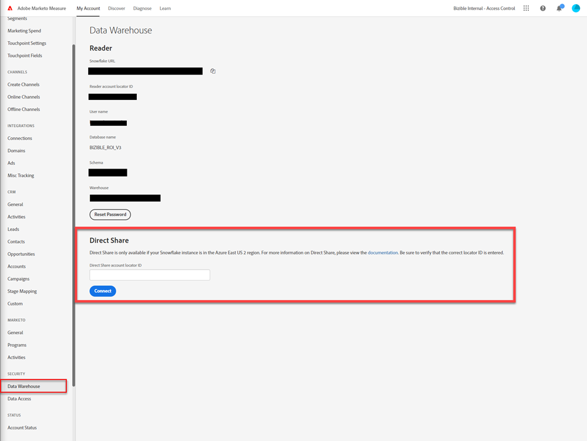

# Data Warehouse存取 — 直接共用 {#data-warehouse-access-direct-share}

## 需求 {#requirements}

若要讓[!DNL Marketo Measure]設定直接共用至資料倉儲，您必須符合下列要求。

* 您有自己的Snowflake執行個體。
* 您的Snowflake執行個體位於Azure East US 2 Snowflake區域。
* 您提供[!DNL Marketo Measure]您的Snowflake帳戶識別碼。

## 限制 {#limitations}

[!DNL Marketo Measure]將只能以Azure East US 2中的帳戶設定Snowflake直接共用(這是Marketo Measure的限制，不能使用Snowflake)。 如果您需要讓您的資料在其他Snowflake地區可用，建議您在Azure US 2東部的Snowflake帳戶中製作資料復本，並使用[Snowflake資料庫復寫](https://docs.snowflake.com/en/user-guide/database-replication-intro.html){target="_blank"}功能，在您選擇的Snowflake地區/帳戶中複製您的資料。

## 輸入Snowflake帳戶ID {#enter-snowflake-account-id}

開啟Marketo Measure應用程式中的&#x200B;**設定**&#x200B;區段，並導覽至&#x200B;**Data Warehouse**&#x200B;頁面。 在&#x200B;**直接共用**&#x200B;區段中，在提供的方塊中輸入您的[Snowflake帳戶識別碼](https://docs.snowflake.com/en/user-guide/admin-account-identifier.html){target="_blank"}，然後按一下&#x200B;**連線**。



## 存取共用 {#accessing-the-share}

為提供的帳戶ID建立共用後，您必須在Snowflake執行個體中完成[設定步驟](https://docs.snowflake.com/en/user-guide/data-share-consumers.html){target="_blank"}才能存取資料。

>[!NOTE]
>
>您可以選擇任何想要的資料庫名稱。 只要許可權存在於您的Snowflake執行個體中，您就可以將許可權指派給任何您選擇的角色。

* 使用帳戶管理員角色

```
USE ROLE ACCOUNTADMIN
```

* 檢視可用的共用（這會顯示已授與的共用名稱）

```
SHOW SHARES
```

* 為共用建立資料庫

```
CREATE DATABASE <database_name> FROM SHARE <provider_account>.<share_name>
```

* 授與共用資料庫的許可權

```
GRANT IMPORTED PRIVILEGES ON DATABASE <database_name> TO ROLE <role_name>
GRANT IMPORTED PRIVILEGES ON ALL SCHEMAS IN DATABASE <database_name> TO ROLE <role_name>
```

如需從Snowflake UI完成這些步驟的詳細指示和步驟，請直接參考[Snowflake的檔案](https://docs.snowflake.com/en/user-guide/data-share-consumers.html){target="_blank"}。
