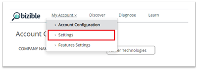
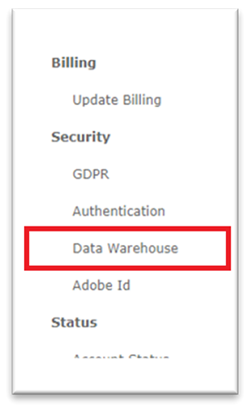
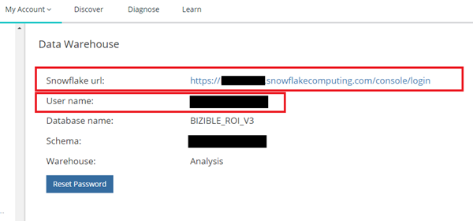
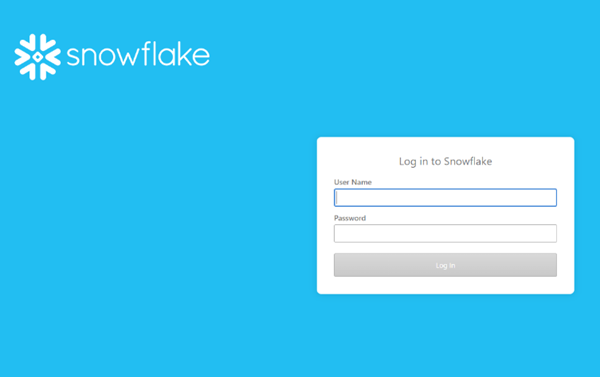
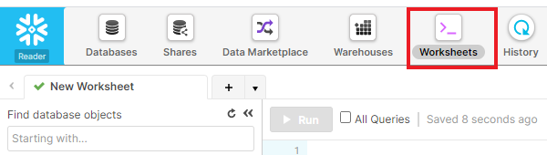
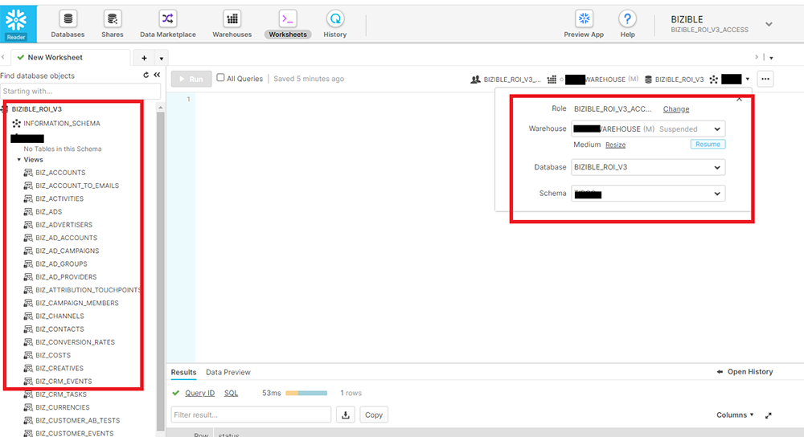
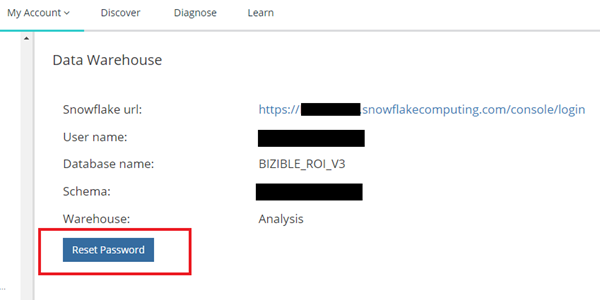
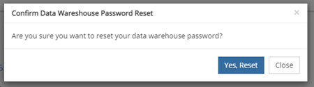
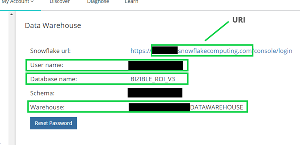

# Data Warehouse存取 — Reader帳戶 {#data-warehouse-access-reader-account}

## Snowflake存取連結 {#snowflake-access-link}

若要存取Snowflake Data Warehouse，您必須導覽至Snowflake帳戶的特定URL。 您可以登入[!DNL Marketo Measure]並依照下列步驟導覽至Data Warehouse資訊頁面，以找到此存取連結。

1. 在[!DNL Marketo Measure]中，按一下頁面頂端的&#x200B;**[!UICONTROL My Account]** > **[!UICONTROL Settings]**。

   

1. 在左側功能表的[安全性]下，按一下&#x200B;**[!UICONTROL Data Warehouse]**。

   

1. 此頁面包含您Snowflake Data Warehouse和使用者名稱的連結。

   

   >[!NOTE]
   >
   >這是唯讀帳戶，可供您的組織使用，而不只是個別使用者。 貴組織內可存取[!DNL Marketo Measure]的任何使用者都可以使用此帳戶登入Snowflake Data Warehouse讀取器帳戶。

1. 按一下Snowflake URL中提供的連結，系統就會將您導向Snowflake登入頁面，讓您在其中輸入使用者名稱和密碼。 _如果您沒有密碼，請參閱下列步驟重設密碼_。

   

1. 登入後，按一下頁面頂端的&#x200B;**[!UICONTROL Worksheets]**。

   

1. BIZIBLE_ROI_V3資料庫物件位於熒幕左側。 從查詢視窗頂端的下拉式清單選項輸入倉儲、資料庫和綱要。 每個應該只有一個選項。 現在您已準備好在Snowflake查詢編輯器中執行查詢。

   

## 重設密碼 {#reset-your-password}

[!DNL Marketo Measure]無法存取您的Snowflake登入密碼。 如果您必須重設密碼，請按一下Data Warehouse資訊頁上的[!UICONTROL Reset Password]按鈕，然後依照指示操作。 臨時密碼會立即顯示在UI中。 下次登入Data Warehouse時，系統會提示您建立自己的密碼。

>[!NOTE]
>
>* 重設密碼會為您組織中的所有[!DNL Marketo Measure]使用者重設密碼，而不只是目前登入的使用者。
>* 我們只會在UI中顯示臨時密碼。 將不會傳送電子郵件。

## 透過協力廠商工具連線Snowflake {#connecting-to-snowflake-via-third-party-tools}

您必須輸入一些資訊，才能將Snowflake Data Warehouse連線至協力廠商工具。

>[!NOTE]
>
>每個工具的連線需求都不同；建議您參閱檔案，瞭解嘗試連線的特定工具。

* **URI** （永遠必要）
   * 這是Snowflake帳戶的網域名稱。 它包含在Snowflake登入連結的一部分中。
* **使用者名稱** （永遠必要）
   * 使用者名稱列在[!DNL Marketo Measure]的Data Warehouse資訊頁中。
* **密碼** （永遠必要）
   * 這是您第一次登入Snowflake帳戶時所設定的密碼。 若要重設密碼，請參閱上述步驟。
* **資料庫名稱** （非永遠必要）
   * 資料庫是將資料儲存在Snowflake中。 而是儲存資源。 資料庫名稱列在[!DNL Marketo Measure]的Data Warehouse資訊頁中。
* **倉儲名稱** （非永遠必要）
   * Warehouse就是在Snowflake中執行查詢的地方。 這是運算資源。 倉儲名稱列在[!DNL Marketo Measure]的Data Warehouse資訊頁中。

  
