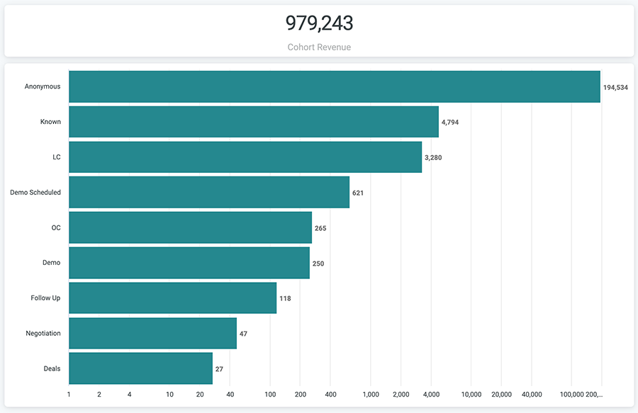

# 同類群組歷程控制面板檔案 {#cohort-journey-dashboard-documentation}

「同類群組影響」和「漏斗」控制面板可讓行銷人員檢視從所選時間範圍內開始同類群組階段的進展，並測量轉換率。

主要差異在於我們如何從同類群組階段計算每個實體。

* 同類群組漏斗：每個階段的結果直接從前一階段得出。

   * 只會計算在設定的同類群組開始時間後，從漏斗各個階段經過的記錄。

* 同類群組影響：每個階段的結果來自同類群組階段，而非先前階段。

   * 每個階段中的所有記錄只要發生在設定的同類群組開始時間之後，即會計算。 此控制面板自然會有比漏斗控制面板更多的記錄，因為我們要查看的是實體如何從同類群組階段受到影響，而不只是漏斗中的移動。

每個控制面板有兩個圖磚：

* 同類群組收入：「同類群組歷程」圖磚「交易」階段中所有商機的總商機量。
* 同類群組歷程：在所選時間範圍內，從起始同類群組階段晉升至每個歷程階段。

>[!NOTE]
>
>在所有Discover控制面板中，只能報告一個人員物件，即銷售機會或聯絡人。 此設定於 [!UICONTROL Settings] > [!UICONTROL Reporting] > [!UICONTROL Attribution Settings] > [!UICONTROL Default Dashboard Object].

此控制面板支援下列篩選器：

* 同類群組階段：選取起始同類群組階段。 後續所有階段的記錄都是從同類群組階段的記錄中演化而來。
* 同類群組日期範圍：選取所選同類群組階段的時間範圍。 它會與同類群組階段一起定義起始資料集。
* 截止日期：選擇以下所有階段的記錄進展必須發生的日期。 預設為今天。 請注意，這適用於同類群組階段以外的所有階段。
* 管道：依管道篩選記錄。 如果其任何接觸點都與管道相關聯，則記錄會與管道相關聯。
* 子頻道：依子通道篩選記錄。 如果記錄的任何接觸點都與子管道相關聯，則記錄會與子管道相關聯。
* 促銷活動：依促銷活動篩選記錄。 如果促銷活動的任何接觸點都與促銷活動相關聯，則記錄會與促銷活動相關聯。
* 促銷活動來源：依促銷活動來源篩選記錄。 促銷活動來源範例為 [!DNL Adwords], [!DNL BingAds], [!DNL Facebook], [!DNL LinkedIn]、等 如果任何接觸點與促銷活動來源相關聯，則記錄會與促銷活動來源相關聯。
* 群體篩選：依自訂區段篩選記錄。 如果任何接觸點都與區段相關聯，則記錄會與區段相關聯。

對所有篩選器都使用「AND」邏輯。

>[!NOTE]
>
>區段篩選器只會套用至LC階段和之後。 如果「同類群組階段」為「未知」或「已知」，且其中一個區段篩選器有值，控制面板將不會傳回任何結果。

階段包括未知、已知、LC、未結銷售機會/聯繫人階段（設定> CRM >階段映射）中的選定漏斗階段、OC、未結銷售機會階段（設定> CRM >階段映射）中的選定漏斗階段和交易（已結成功銷售機會）。

>[!NOTE]
>
>歷程階段的記錄計數（定義為同類群組階段以外的任何階段）包含所有與同類群組記錄相關的新記錄，這些新記錄會在所選時間範圍的開始日期之後和截止日期之前建立。 這就是因果關係。

您可以從每個條向下鑽取以查看每個階段的記錄。

* 針對「未知」，會顯示匿名訪客詳細資料。
* 若為已知，則會顯示已知的訪客詳細資料。
* 對於LC和開啟銷售機會/聯繫階段，它顯示銷售機會/聯繫人詳細資訊。
* 對於OC 、 Open Opportunity階段和Deals ，它顯示Opportunity詳細資訊。
