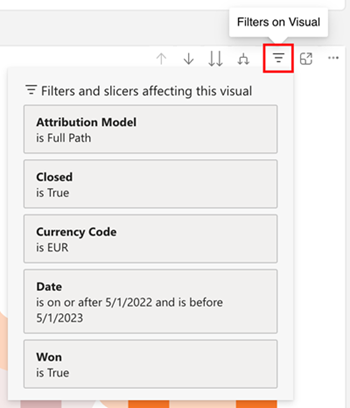

# 探索儀表板基本知識 {#discover-dashboard-basics}

本文將引導您瞭解重新設計介面的基礎功能，確保您可以輕鬆存取和解讀資料。 深入瞭解篩選器窗格的動態，並找出增強型報告功能的複雜之處，例如鑽床功能、交叉篩選和工具提示。

>[!NOTE]
>
>此儀表板目前是Beta版。 在此過渡階段中，目前和新的儀表板皆可存取。 一旦我們完全轉換並確保最佳功能，目前的儀表板將被棄用。

## 篩選窗格 {#filter-pane}

每個儀表板都具備一系列篩選器，以及以下無縫導覽和自訂的控制項。

<table style="table-layout:auto"> 
 <tbody> 
  <tr> 
   <th>名稱</th> 
   <th>說明</th>
  </tr> 
  <tr> 
   <td><b>篩選器切換按鈕</b></td>
   <td>將篩選窗格切換為開啟或關閉。
   
</td>
  </tr>
  <tr> 
   <td><b>搜尋列</b></td>
   <td>使用篩選器窗格頂端的搜尋功能來搜尋特定篩選器。 每個篩選器都有自己的搜尋列。
   
</td>
  </tr>
   <tr> 
   <td><b>清除篩選器按鈕</b></td>
   <td>若要清除濾鏡，請按一下位於每個濾鏡右上角的橡皮擦圖示。
   
</td>
  </tr>
  <tr> 
   <td><b>套用按鈕</b></td>
   <td>按一下以確認並在控制面板上實作您的篩選器變更。
   
</td>
  </tr>
 </tbody> 
</table>

## 視覺效果上的篩選器 {#filters-on-visual}

暫留在視覺效果的右上角，可檢視已套用篩選器的唯讀清單。

## 報表功能 {#report-capabilities}

### 向下及向上鑽研 {#drill-down-and-up}

* 將滑鼠懸停在視覺效果上以識別其是否有階層；動作列中鑽研控制選項的存在表示此情形。

* 按一下以灰色背景反白的向下單一箭頭來啟動向下鑽研。 若要還原，請使用向上鑽研圖示。

若要一次向下鑽研一個欄位，請開啟向下鑽研圖示並選取視覺元素，例如長條圖。

使用雙箭頭向下鑽研圖示來前進到下一個階層層級。

使用類似分叉圖示，在目前檢視中新增額外的階層層級。

### 鑽研 {#drill-through}

若要探索視覺效果背後的資料，請以滑鼠右鍵按一下視覺元素，然後選取「鑽研」選項。

### 匯出資料 {#export-data}

若要從視覺效果匯出基礎資料，請將游標停留在視覺效果的右上角。 按一下「更多選項」按鈕，選擇「匯出資料」，選取您偏好的格式，然後按一下「匯出」。

### 焦點模式 {#focus-mode}

若要放大特定視覺效果或圖磚，請將游標移至右上角並選取「焦點」按鈕。

### 交叉篩選 {#cross-filtering}

在一個視覺效果中選取值或軸標籤，即可交叉篩選報表頁面上的其他視覺效果，確保這些視覺效果只會顯示相關的已篩選資料。

### 工具提示 {#tooltips}

工具提示提供所顯示資料的補充詳細資料。 只要將滑鼠指標暫留在視覺元素上，內容工具提示就會隨即顯示，提供與該特定資料點相關的深入分析或說明。

