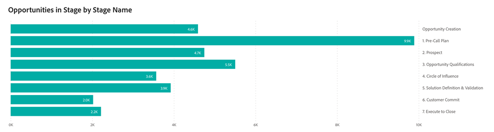

# Passport儀表板 {#passport-dashboard}

Passport儀表板可讓行銷人員在指定期間內透過不同階段轉換時，動態檢視潛在客戶、聯絡人和機會。 透過篩選特定日期，使用者也可以取得當天的記錄快照。

>[!NOTE]
>
>此儀表板目前是Beta版。 在此過渡階段中，目前和新的儀表板皆可存取。 一旦我們完全轉換並確保最佳功能，目前的儀表板將被棄用。

**展示板回答的問題：**

* 每個非終端機階段中，所選日期上有多少銷售機會、聯絡人或銷售機會？
* 在指定的期間內，有多少不同的潛在客戶或聯絡人會進行到每個暫時的階段？
   * _範例_：如果銷售機會A在2023年1月1日處於階段1，並在2023年3月31日之前進入階段5，則2023年第1季的Passport分析會將銷售機會A計入階段1到5。
* 在指定的時間範圍內，每個暫時階段傳遞了多少個不重複的機會？

## 控制面板元件 {#dashboard-components}

### 階段中的機會（依階段名稱） {#opportunities-in-stage-by-stage-name}

* 每個階段會顯示具有接觸點，且在指定時間範圍內傳遞的機會數量。
   * 如果機會在該範圍內的多個階段中進行，則會將其計入每個階段中。
* 排除終端機階段，例如「已關閉的贏家」和「已關閉的輸家」。
* 開始和結束日期皆包含。

### 依據階段名稱的階段中的潛在客戶或聯絡人 {#leads-or-contacts-in-stage-by-stage-name}

* 每個階段會顯示具有接觸點，且在指定時間範圍內經過的Lead或Contact數量。
   * 是否顯示「銷售機會」或「連絡人」取決於在「設定>歸因設定>預設儀表板物件」中設定的偏好設定。
   * 如果Lead或Contact在該範圍內的多個階段中進行，則會將其計入每個階段。
* 排除終端機階段，例如「已關閉的贏家」和「已關閉的輸家」。
* 開始和結束日期皆包含。

## 篩選窗格 {#filter-pane}

此儀表板配備了下列設定和篩選器：

* 日期（根據轉換日期）
* 歸因模型
* 頻道、子頻道
* Campaign
* 區段

>[!MORELIKETHIS]
>
>* [探索儀表板基本知識](/help/marketo-measure-discover-ui/dashboards/discover-dashboard-basics.md){target="_blank"}
>* [控制面板資料可見性原則](/help/marketo-measure-discover-ui/dashboards/dashboard-data-visibility-policy.md){target="_blank"}

