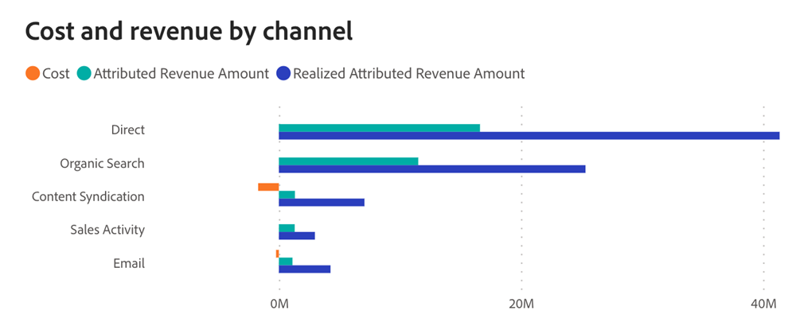
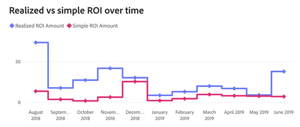

# ROI控制面板 {#roi-dashboard}

ROI控制面板為行銷人員提供了跨管道、子管道和行銷活動的投資回報細微檢視。 它細緻地劃分成本和收入模式，同時重點指出每個銷售機會的成本、交易和機會等量度，以確保對行銷歸因的全面瞭解。

>[!NOTE]
>
>此儀表板目前是Beta版。 在此過渡階段中，目前和新的儀表板皆可存取。 一旦我們完全轉換並確保最佳功能，目前的儀表板將被棄用。

**展示板回答的問題**

* 每個管道、子管道和行銷活動的ROI值為何？
* 成本和收入如何在每個管道、子管道和行銷活動中分配？
* 每個潛在客戶的成本、每個交易的成本，以及每個商機的成本是多少？

## 控制面板元件 {#dashboard-components}

### KPI動態磚 {#kpi-tiles}

* **成本**：來自連線資料來源和手動上傳成本的總成本。
* **已歸因的收入**：根據所選歸因模型，從接觸點在篩選日期期間內關閉的商機中貢獻的總收入。
* **已實現歸因收入**：根據所選歸因模型，在篩選的日期期間內具有接觸點的商機中的總收入貢獻，無論何時關閉。
* **新潛在客戶總數**：產生的新銷售機會總數，包括接觸和未接觸的銷售機會。
* **每個新潛在客戶的成本**：每個新銷售機會的平均成本，從總成本除以新銷售機會總數得出。
* **新機會總數**：產生的新商機總數，包括接觸和未接觸商機。
* **每個新機會的成本**：每個新商機的平均成本，由總成本除以新商機總數得出。
* **交易總數**：「成功的已關閉」商機數目，包括沒有接觸點的商機。
* **簡單ROI**：已歸因的收入除以篩選日期期間的成本。
* **實現的投資報酬率**：已實現歸因收入除以篩選日期期間的成本。

### 依管道的成本和收入圖表 {#cost-and-revenue-by-channel-graph}

橫條圖展示成本和收入，旨在提供各個管道、子管道和促銷活動相關數值的比較透視。

* 運用向下鑽研和向上鑽研功能，依子管道和促銷活動將資料分類。
* 將滑鼠停留在每個長條圖上，即可檢視簡易與已實現的ROI。

**圖表回答的問題**

* 每個管道、子管道和行銷活動的ROI值為何？
* 是否有任何極端值管道或子管道的收入成本異常高或異常低？

### 隨時間變化的實現與簡單ROI {#realized-vs-simple-roi-over-time}

顯示已實現和簡單ROI之間比較的時間序列折線圖，追蹤其隨時間的進展。

* 將滑鼠指標暫留在圖表上的區段上，即可檢視簡易與已實現的ROI。

**圖表回答的問題**

* 與特定時段的簡單ROI相比，已實現的ROI如何？
* 同一期間實現投資報酬率的趨勢與任何重大行銷活動有何關係？

### 隨時間變化的成本圖表 {#cost-over-time-graph}

顯示總成本的棧疊長條圖，依每個月/季/年的相關管道分段。

* 運用向下鑽研和向上鑽研功能，依月、季或年對資料進行分類。
* 將滑鼠指標暫留在長條圖區段或長條圖之間的空白處，即可顯示詳細資訊。

**圖表回答的問題**

* 所有管道的合併成本從一個季度/月到下一個季度/月的比較結果如何？
* 特定管道的成本如何隨時間演變？

### 依據管道的成本圖表 {#cost-by-channel-graph}

長條圖顯示依頻道/子頻道/行銷活動分段的行銷支出。

* 運用向下鑽研和向上鑽研功能，依頻道/子頻道/行銷活動將資料分類。

**圖表回答的問題**

* 主要管道中的哪些子管道或行銷活動具有最高的配置？
* 相較於其他行銷管道（頻道、子頻道或行銷活動），哪些行銷管道的資金似乎不足？

### ROI摘要表格 {#roi-summary-table}

此表格顯示依個別管道分段的歸因收入、成本和ROI，以取得詳細劃分。

* 按一下每個管道旁的「+」圖示，即可顯示依子管道和促銷活動的劃分。

**欄**

* 管道/子管道/行銷活動
* 成本
* 已歸因的收入
* 已實現歸因收入
* 簡單ROI
* 實現的投資報酬率
* 未實現的已歸因管道收入：連結到在篩選日期期間內建立的接觸點（未解決的商機）的管道收入。

### 行銷支出表格 {#marketing-spend-table}

此表格顯示成本、新銷售機會、商機以及依個別管道劃分的已結束交易，以進行詳細劃分。

* 按一下每個管道旁的「+」圖示，即可顯示依子管道和促銷活動的劃分。

**欄**

* 管道/子管道/行銷活動
* 成本
* 新銷售機會
* 每個新潛在客戶的成本
* 新商機
* 每個新機會的成本
* 交易
* 每筆交易的成本

## 篩選窗格 {#filter-pane}

此儀表板配備了下列設定和篩選器：

* 日期
   * 根據：
      * 建立日期：新銷售機會、新銷售機會
      * 成本發生日期：成本
      * 結束日期：歸因收入（簡單ROI）、交易
      * 接觸點日期：已實現歸因收入（已實現ROI）的接觸點
* 歸因模型
* 頻道、子頻道
* Campaign

>[!MORELIKETHIS]
>
>* [探索儀表板基本知識](/help/marketo-measure-discover-ui/dashboards/discover-dashboard-basics.md){target="_blank"}
>* [控制面板資料可見性原則](/help/marketo-measure-discover-ui/dashboards/dashboard-data-visibility-policy.md){target="_blank"}

