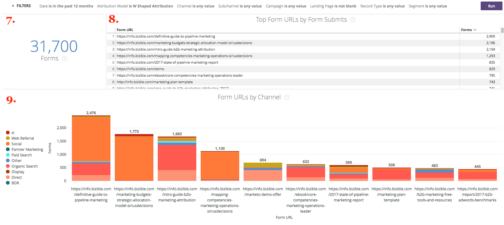
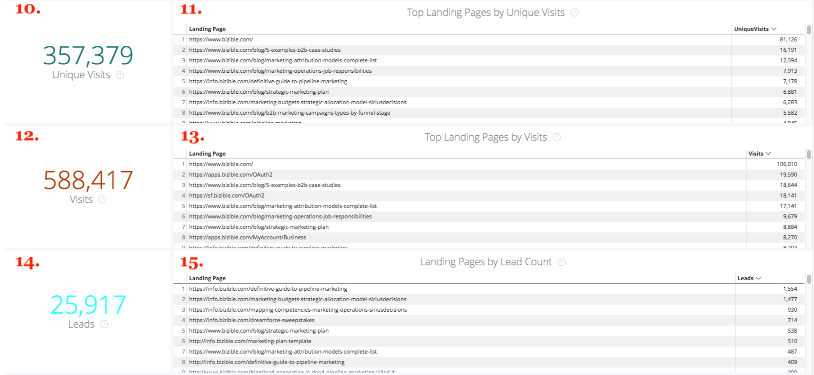

# 鑽研 {#drill-throughs}

此 [!DNL Marketo Measure Discover] 體驗可讓客戶深入瞭解他們最關心的資料集。 在整個中的某些測量上 [!DNL Marketo Measure Discover]，客戶可按一下圖磚，深入瞭解該量度。

底下是包含鑽研之控制面板和圖磚的清單，以及使用者在鑽研時應期望的體驗。 請記住，鑽研時會保留圖示板中的全域篩選器。

## 概觀 {#overview}

**收入**

定義：透過長條圖和表格依月份的總收入。 從那裡，可以按周、日或時間鑽研至單一月或劃分一個月。

**收入（圖表）**

定義：透過長條圖和表格依月份的總收入。 由於父圖磚已是長條圖，因此鑽研至「顯示詳細資料」將只會顯示單一月。

_深入分析：按周或日期劃分的按月收入總計。_

**支出**

定義：透過長條圖和表格依月份的總支出。 從那裡，可以按周、日或時間鑽研至單一月或劃分一個月。

**交易**

定義：透過長條圖和表格按月顯示交易總數。 從那裡，可以按周、日或時間鑽研至單一月或劃分一個月。

**Pipeline收入**

定義：透過長條圖和表格依月份的總管道收入。 從那裡，可以按周、日或時間鑽研至單一月或劃分一個月。

**ROI摘要**

定義：每個管道透過長條圖和表格按月的總收入或支出。 從那裡，可以鑽研至該列一個月，或依周、日或時間劃分一個月。

**每筆交易的成本**

定義：總支出除以交易總數，提供取得已結束的成功機會所需的平均成本。 從那裡，可以鑽研至該列一個月，或依周、日或時間劃分一個月。

**依收入顯示的管道**

定義：透過長條圖和表格，按月顯示每個管道的總收入。 從那裡，可以鑽研至該列一個月，或依周、日或時間劃分一個月。

**依收入區分的子管道**

定義：每個子管道透過長條圖和表格按月的總收入。 從那裡，可以鑽研至該列一個月，或依周、日或時間劃分一個月。

**依收入區分的行銷活動**

定義：透過長條圖和表格，按月顯示各促銷活動的總收入。 從那裡，可以鑽研至該列一個月，或依周、日或時間劃分一個月。

**交易摘要**

定義：透過長條圖和表格，依月份顯示每個管道的總支出或交易計數。 從那裡，可以鑽研至該列一個月，或依周、日或時間劃分一個月。

## 成長 {#growth}

**總收入**

定義：透過長條圖和表格依月份的總收入。 從那裡，可以按周、日或時間鑽研至單一月或劃分一個月。

**一段時間的收入**

定義：透過長條圖和表格依月份的總收入。 由於父系圖磚已是圖表，因此鑽研至「顯示詳細資料」只會顯示單一月。

_按月劃分的總收入，依周或日期劃分。_

**交易總數**

定義：透過長條圖和表格按月顯示交易總數。 從那裡，可以按周、日或時間鑽研至單一月或劃分一個月。

**一段時間的交易**

定義：透過長條圖和表格按月顯示交易總數。 由於父系圖磚已是圖表，因此鑽研至「顯示詳細資料」只會顯示單一月。

_依月份依周或日期劃分的交易總數。_

**總管道收入**

定義：透過長條圖和表格依月份的總管道收入。 從那裡，可以按周、日或時間鑽研至單一月或劃分一個月。

**一段時間內的管道收入**

定義：透過長條圖和表格依月份的總管道收入。 由於父系圖磚已是圖表，因此鑽研至「顯示詳細資料」只會顯示單一月。

_依月份劃分的管道總收入，依周或日期劃分。_

**潛在客戶總數**

定義：透過長條圖和表格依月數區分的潛在客戶總數。 從那裡，可以按周、日或時間鑽研至單一月或劃分一個月。

**一段時間內的銷售機會**

定義：透過長條圖和表格依月數區分的潛在客戶總數。 由於父系圖磚已是圖表，因此鑽研至「顯示詳細資料」只會顯示單一月。

_依月份劃分的銷售機會總數，依周或日期劃分。_

**連絡人總數**

定義：透過長條圖和表格依月份列出的聯絡人總數。 從那裡，可以按周、日或時間鑽研至單一月或劃分一個月。

**一段時間的連絡人**

定義：透過長條圖和表格依月份列出的聯絡人總數。 由於父系圖磚已是圖表，因此鑽研至「顯示詳細資料」只會顯示單一月。

_依月份依周或日期劃分的聯絡人總數。_

**機會總數**

定義：透過長條圖和表格依月份的業務機會總數。 從那裡，可以按周、日或時間鑽研至單一月或劃分一個月。

**一段時間的機會**

定義：透過長條圖和表格依月份的業務機會總數。 由於父系圖磚已是圖表，因此鑽研至「顯示詳細資料」只會顯示單一月。

_依月份依周或日期劃分的機會總數。_

**不重複造訪**

定義：透過長條圖和表格按月檢視頁面總數。 從那裡，可以按周、日或時間鑽研至單一月或劃分一個月。

**一段時間的不重複造訪**

定義：顯示特定時段內趨勢的不重複造訪總數。 使用依篩選器的群組，可依頻道、子頻道、行銷活動、帳戶、廣告群組、廣告、廣告商、創意、關鍵字、版位和網站變更棧疊。 如果停用此功能，將顯示為空白。

**造訪**

定義：透過長條圖和表格按月劃分的網站造訪總數。 從那裡，可以按周、日或時間鑽研至單一月或劃分一個月。

**一段時間內的造訪**

定義：顯示特定時段內趨勢的追蹤網站造訪總數。 使用依篩選器的群組，可依頻道、子頻道、行銷活動、帳戶、廣告群組、廣告、廣告商、創意、關鍵字、版位和網站變更棧疊。 如果停用此功能，將顯示為空白。

**Forms**

定義：依月份透過長條圖和表格提交的表單總數。 從那裡，可以按周、日或時間鑽研至單一月或劃分一個月。

**一段時間內的Forms**

定義：在特定期間內顯示趨勢的已提交表單總數。 使用依篩選器的群組，可依頻道、子頻道、行銷活動、帳戶、廣告群組、廣告、廣告商、創意、關鍵字、版位和網站變更棧疊。 如果停用此功能，將顯示為空白。

## 支出 {#spend}

**支出**

定義：透過長條圖和表格依月份的總支出。 從那裡，可以按周、日或時間鑽研至單一月或劃分一個月。

**支出（圖表）**

定義：透過長條圖和表格依月份的總支出。 由於父系圖磚已是圖表，因此鑽研至「顯示詳細資料」只會顯示單一月。

_依周、日期或時間劃分的按月總支出。 逗留時間始於 [!DNL Marketo Measure] 從我們的廣告連線中每分鐘的實際下載支出。_

**依據管道的支出**

定義：每個管道透過長條圖和表格按月的總支出。 從那裡，可以鑽研至該列一個月，或依周、日或時間劃分一個月。

**依據子管道的支出**

定義：每個子管道透過長條圖和表格按月的總支出。 從那裡，可以鑽研至該列一個月，或依周、日或時間劃分一個月。

**依據行銷活動的支出**

定義：透過長條圖和表格，依月份顯示各促銷活動的總支出。 從那裡，可以鑽研至該列一個月，或依周、日或時間劃分一個月。

## 銷售速度 {#sales-velocity}

**速度（天）**

定義：從第一次匿名接觸到商機關閉，商機在其銷售週期中的平均天數。

**作用中的機會**

定義：來自任何未結商機的商機總數，表示它不是「已結失敗」或「已結成功」。

**交易規模**

定義：已結束的成功商機的平均金額。

**獲勝率**

定義：「已結成功」商機的總數除以「已結失敗」與「已結成功」商機的總數。

**各管道的機會速度**

定義：每個階段的機會在其週期中的平均天數，依行銷管道分組，並顯示進入下一個階段所需的時間。 此處顯示的階段是里程碑階段(FT、LC、OC)和自訂階段。

**依據管道的銷售機會速度**

定義：潛在客戶在轉換為聯絡人/商機/金額之前，每個階段處於週期的平均天數，依行銷管道分組，並顯示進入下一個階段所需的時間長度。 此處顯示的階段是里程碑階段(FT、LC)和自訂階段。

**平均機會速度**

定義：每個階段中「商機」處於週期的平均天數，顯示進入下一個階段所需的時間。 此處顯示的階段是里程碑階段(FT、LC、OC)和自訂階段。 此處的數字透過頻道圖表反映機會速度中每個階段的時間。

**平均銷售機會速度**

定義： Lead在轉換為聯絡人/商機/金額之前，每個階段處於週期的平均天數，顯示進入下一個階段所需的時間。 此處顯示的階段是里程碑階段(FT、LC)和自訂階段。 此處的數字透過管道圖表反映潛在客戶速度中每個階段的時間。

**一段時間內的機會速度**

定義：「商機」在每個階段週期中的平均天數，並具有一段時間的趨勢。

**一段時間內的潛在客戶速度**

定義：「銷售機會」在每個階段的週期中的平均天數，且會隨著時間而改變。

## 帳戶型行銷 {#account-based-marketing}

**總收入**

定義：透過長條圖和表格依月份的總收入。 從那裡，可以按周、日或時間鑽研至單一月或劃分一個月。

**總管道收入**

定義：透過長條圖和表格依月份的總管道收入。 從那裡，可以按周、日或時間鑽研至單一月或劃分一個月。

**符合的潛在客戶**

定義：與帳戶成功比對的潛在客戶總數。

**接觸過的帳戶**

定義：接收任何接觸點的帳戶總數。

**接觸的機會**

定義：商機ID及其對應帳戶ID的清單

**接觸過的連絡人**

定義：連絡人ID及其對應帳戶ID的清單

**一段時間的接觸點（圖表）**

定義：選定月份的接觸點清單。

_依周、日期或時間劃分的接觸點數量。_

**一段時間內接觸的科目（圖表）**

定義：所選月份的帳戶ID清單。

_依周、日期或時間劃分的帳戶數量。_

## 網站分析 {#web-analytics}

**不重複造訪**

定義：透過長條圖和表格按月的不重複網站造訪總數。 從那裡，可以按周、日或時間鑽研至單一月或劃分一個月。

**每次不重複造訪成本**

定義：總支出除以不重複造訪總數。 從那裡，可以按周、日或時間鑽研至單一月或劃分一個月。

**依據登陸頁面的不重複造訪**

定義：根據每個URL不重複訪客數的登入頁面清單。

**依來源的不重複造訪**

定義：網站不重複訪客來源的檢視。

**一段時間內的不重複造訪**

定義：追蹤的不重複造訪總數，顯示特定時間範圍內的趨勢。

**造訪**

定義：透過長條圖和表格按月劃分的網站造訪總數。 從那裡，可以按周、日或時間鑽研至單一月或劃分一個月。

**每次造訪成本**

定義：總支出除以造訪總數。

**依據登陸頁面的瀏覽次數**

定義：根據每個URL的造訪次數的登入頁面清單。

**依據來源的造訪**

定義：您網站的訪客來源。 可依頻道、子頻道、行銷活動、帳戶、廣告群組、廣告、廣告商、創意、關鍵字、位置和網站來變更。

**一段時間內的造訪**

定義：追蹤的造訪總數，顯示特定時間範圍內的趨勢。 從那裡，可以按周、日或時間鑽研至單一月或劃分一個月。

**頁面檢視**

定義：透過長條圖和表格按月檢視頁面總數。 從那裡，可以按周、日或時間鑽研至單一月或劃分一個月。

**每次頁面檢視成本**

定義：總支出除以追蹤的頁面檢視總數。

**依URL的頁面檢視**

定義：頁面URL清單，根據每個URL的頁面檢視次數。

**一段時間的頁面檢視**

定義：透過長條圖和表格依月份的總頁面檢視次數。 由於父系圖磚已是圖表，因此鑽研至「顯示詳細資料」只會顯示單一月。

_依周、日期或時間劃分的按月頁面檢視總數。_

**一段時間內的Forms**

定義：追蹤的表單總數，顯示特定時間範圍內的趨勢。

**Forms**

定義：依月份透過長條圖和表格提交的表單總數。 從那裡，可以按周、日或時間鑽研至單一月或劃分一個月。

**每個表單的成本**

定義：總支出除以提交的表單總數。

**依據表單URL提交的表單**

定義：根據各URL上提交編號的表單URL清單。

**各登陸頁面的銷售機會**

定義：根據從每個登陸頁面產生的潛在客戶數的登陸頁面清單。

**依據表單URL的銷售機會**

定義：根據從每個URL產生的潛在客戶數的表單URL清單。

## CMO {#cmo}

**收入**

定義：透過長條圖和表格依月份的總收入。 從那裡，可以按周、日或時間鑽研至單一月或劃分一個月。

**收入（圖表）**

定義：透過長條圖和表格依月份的總收入。 由於父圖磚已是長條圖，因此鑽研至「顯示詳細資料」將只會顯示單一月。

_按月劃分的總收入，依周或日期劃分。_

**支出**

定義：透過長條圖和表格依月份的總支出。 從那裡，可以按周、日或時間鑽研至單一月或劃分一個月。

**ROI**

定義：總收入和總支出的計算投資報酬率（根據歸因模型）。

**交易**

定義：透過長條圖和表格按月顯示交易總數。 從那裡，可以按周、日或時間鑽研至單一月或劃分一個月。

**每筆交易的成本**

定義：總支出除以交易總數，提供取得一個成功商機所需的平均成本。

**Pipeline收入**

定義：透過長條圖和表格依月份的總管道收入。 從那裡，可以按周、日或時間鑽研至單一月或劃分一個月。

**交易規模**

定義：已結束的成功商機的平均金額。

**依收入顯示的管道**

定義：透過長條圖和表格，按月顯示每個管道的總收入。 從那裡，可以鑽研至該列一個月，或依周、日或時間劃分一個月。

**依收入區分的子管道**

定義：每個子管道透過長條圖和表格按月的總收入。 從那裡，可以鑽研至該列一個月，或依周、日或時間劃分一個月。

**依收入區分的行銷活動**

定義：透過長條圖和表格，按月顯示各促銷活動的總收入。 從那裡，可以鑽研至該列一個月，或依周、日或時間劃分一個月。

**ROI摘要**

定義：每個管道透過長條圖和表格按月的總收入或支出。 從那裡，可以鑽研至該列一個月，或依周、日或時間劃分一個月。

**交易摘要**

定義：透過長條圖和表格，依月份顯示每個管道的總支出或交易計數。 從那裡，可以鑽研至該列一個月，或依周、日或時間劃分一個月。

## 內容行銷 {#content-marketing}

**總收入**

定義：透過長條圖和表格依月份的總收入。 從那裡，可以按周、日或時間鑽研至單一月或劃分一個月。

**依收入的登陸頁面**

定義：透過長條圖和表格從每個登陸頁面得出的總收入。 從那裡，可以鑽研至該列一個月，或依周、日或時間劃分一個月。

**總管道收入**

定義：透過長條圖和表格依月份的總管道收入。 從那裡，可以按周、日或時間鑽研至單一月或劃分一個月。

**依據管道收入的登陸頁面**

定義：透過長條圖和表格從每個登陸頁面取得的總管道收入。 從那裡，可以鑽研至該列一個月，或依周、日或時間劃分一個月。

**機會總數**

定義：透過長條圖和表格，依月份的業務機會總數。 從那裡，可以按周、日或時間鑽研至單一月或劃分一個月。

**依機會計數區分的登陸頁面**

定義：透過長條圖和表格從每個登陸頁面取得的機會總數。 從那裡，可以鑽研至該列一個月，或依周、日或時間劃分一個月。

**Forms總數**

定義：透過長條圖和表格按月劃分的表單總數。 從那裡，可以按周、日或時間鑽研至單一月或劃分一個月。

**依據表單提交排名在前的表單URL**

定義：每個表單URL透過長條圖和表格的表單總數。 從那裡，可以鑽研至該列一個月，或依周、日或時間劃分一個月。

**依據管道的表單URL**

定義：每月透過長條圖和表格從表單URL提交的表單總數。 從那裡，可以鑽研至該列一個月，或依周、日或時間劃分一個月。

**不重複造訪**

定義：追蹤所有已知和匿名訪客的不重複網站造訪總數。 深入研究以檢視按月追蹤的不重複網站造訪。

**依不重複造訪排名最前的登陸頁面**

定義：根據每個登陸頁面不重複造訪次數的登陸頁面清單。 深入檢視所選URL的每月不重複造訪。

**造訪**

定義：追蹤的所有已知和匿名訪客的網站造訪總數。 深入檢視按月追蹤的網站造訪。

**依瀏覽次數排名的前幾個登陸頁面**

定義：根據每個登入頁面的初始造訪次數的登入頁面清單。 深入檢視所選URL的月造訪次數。

**潛在客戶總數**

定義：透過長條圖和表格按月列出的潛在客戶總數。 從那裡，可以按周、日或時間鑽研至單一月或劃分一個月。

**依潛在客戶計數區分的登陸頁面**

定義：透過長條圖和表格從每個登陸頁面取得的潛在客戶總數。 從那裡，可以鑽研至該列一個月，或依周、日或時間劃分一個月。

## 付費媒體 {#paid-media}

**曝光數**

定義：透過長條圖和表格依月份區分的曝光總數。 從那裡，可以按周、日或時間鑽研至單一月或劃分一個月。

**CPM**

定義：提供的曝光數總計花費除以曝光總數。

**點按次數**

定義：依月份透過長條圖和表格的點按總數。 從那裡，可以按周、日或時間鑽研至單一月或劃分一個月。

**CPC**

定義：追蹤點選的總支出除以總點選數。

**銷售機會**

定義：根據歸因模型的潛在客戶總數。

**CPL**

定義：建立之潛在客戶的總支出除以總點按，以提供CPL率。

**造訪**

定義：透過長條圖和表格按月劃分的網站造訪總數。 從那裡，可以按周、日或時間鑽研至單一月或劃分一個月。

**頁面檢視**

定義：透過長條圖和表格按月檢視頁面總數。 從那裡，可以按周、日或時間鑽研至單一月或劃分一個月。

**行銷活動摘要**

定義：行銷活動清單以每個行銷活動的收入/支出/交易/商機為基礎，根據所選歸因模型以最高者排序。

**廣告摘要**

定義：根據每個廣告的收入/通路收入/支出/交易/商機已根據所選歸因模型的歸因比例所劃分的廣告清單。

**關鍵字摘要**

定義：根據每個關鍵字的收入/管道收入/支出/交易/商機已歸因多少的關鍵字清單（根據所選的歸因模型）。

**依ROI列出的行銷活動**

定義：根據每個行銷活動的計算ROI列出的行銷活動清單，依最高ROI排序。 深入檢視所選行銷活動的收入或支出（依月份）。

**依ROI劃分的廣告**

定義：根據每個廣告的已計算ROI的廣告清單，依最高ROI排序。 深入檢視所選廣告的按月收入或支出。

**依ROI關鍵字**

定義：根據每個關鍵字已計算的ROI的關鍵字清單，依最高ROI排序。 深入檢視選取之關鍵字的按月收入或支出。
