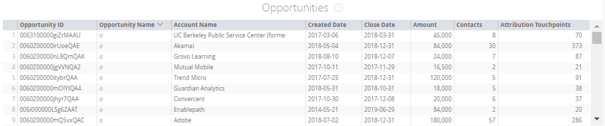
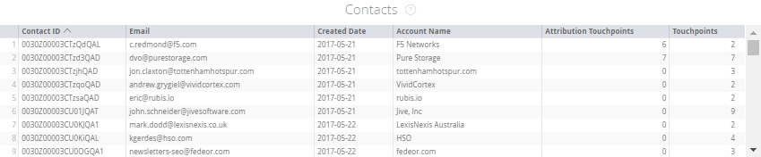

# 行銷操作圖磚 {#marketing-ops-tiles}

行銷作業可讓您驗證和診斷 [!DNL Marketo Measure] 資料可全面掌握每個銷售機會、聯絡人、客戶、行銷活動和商機的個別接觸點。

<table> 
 <colgroup> 
  <col> 
  <col> 
  <col> 
  <col> 
  <col> 
  <col> 
  <col> 
  <col> 
  <col> 
  <col> 
  <col> 
  <col> 
  <col> 
 </colgroup> 
 <tbody> 
  <tr> 
   <td> </td> 
   <td>
<strong>帳戶 ID</strong>
</td> 
   <td>
<strong>帳戶名稱</strong>
</td> 
   <td>
<strong>Opp ID</strong>
</td> 
   <td>
<strong>Opp名稱</strong>
</td> 
   <td>
<strong>潛在客戶或聯絡人ID</strong>
</td> 
   <td>
<strong>潛在客戶或連絡人電子郵件</strong>
</td> 
   <td>
<strong>行銷活動ID</strong>
</td> 
   <td>
<strong>Opp已獲勝</strong>
</td> 
   <td>
<strong>Opp建立日期</strong>
</td> 
   <td>
<strong>開啟關閉日期</strong>
</td> 
   <td>
<strong>接觸點日期</strong>
</td> 
   <td>
<strong>歸因模型</strong>
</td> 
  </tr> 
  <tr> 
   <td>
<strong>帳戶</strong>
</td> 
   <td><strong>X</strong></td> 
   <td><strong>X</strong></td> 
   <td><strong>X</strong></td> 
   <td><strong>X</strong></td> 
   <td><strong>X</strong></td> 
   <td> </td> 
   <td><strong>X</strong></td> 
   <td><strong>X</strong></td> 
   <td><strong>X</strong></td> 
   <td><strong>X</strong></td> 
   <td><strong>X</strong></td> 
   <td><strong>X</strong></td> 
  </tr> 
  <tr> 
   <td>
<strong>機會</strong>
</td> 
   <td><strong>X</strong></td> 
   <td><strong>X</strong></td> 
   <td><strong>X</strong></td> 
   <td><strong>X</strong></td> 
   <td><strong>X</strong></td> 
   <td> </td> 
   <td><strong>X</strong></td> 
   <td><strong>X</strong></td> 
   <td><strong>X</strong></td> 
   <td><strong>X</strong></td> 
   <td><strong>X</strong></td> 
   <td><strong>X</strong></td> 
  </tr> 
  <tr> 
   <td>
<strong>連絡人</strong>
</td> 
   <td><strong>X</strong></td> 
   <td><strong>X</strong></td> 
   <td><strong>X</strong></td> 
   <td><strong>X</strong></td> 
   <td><strong>X</strong></td> 
   <td><strong>X</strong></td> 
   <td><strong>X</strong></td> 
   <td><strong>X</strong></td> 
   <td><strong>X</strong></td> 
   <td><strong>X</strong></td> 
   <td><strong>X</strong></td> 
   <td><strong>X</strong></td> 
  </tr> 
  <tr> 
   <td>
<strong>銷售機會</strong>
</td> 
   <td><strong>X</strong></td> 
   <td><strong>X</strong></td> 
   <td><strong>X*</strong></td> 
   <td><strong>X*</strong></td> 
   <td><strong>X</strong></td> 
   <td><strong>X</strong></td> 
   <td><strong>X</strong></td> 
   <td><strong>X*</strong></td> 
   <td><strong>X*</strong></td> 
   <td><strong>X*</strong></td> 
   <td><strong>X</strong></td> 
   <td><strong>X</strong></td> 
  </tr> 
  <tr> 
   <td>
<strong>行銷活動</strong>
</td> 
   <td><strong>X</strong></td> 
   <td><strong>X</strong></td> 
   <td><strong>X</strong></td> 
   <td><strong>X</strong></td> 
   <td><strong>X</strong></td> 
   <td> </td> 
   <td><strong>X</strong></td> 
   <td><strong>X</strong></td> 
   <td><strong>X</strong></td> 
   <td><strong>X</strong></td> 
   <td><strong>X</strong></td> 
   <td><strong>X</strong></td> 
  </tr> 
 </tbody> 
</table>

## 帳戶拼貼 {#account-tile}

顯示下列與指定帳戶相關的資料。

**帳戶必須有接觸點資料（僅適用於已啟用ABM的情況）**

 — 帳戶ID：CRM中的帳戶ID

-Account Name： CRM中的帳戶名稱

-Created Date： CRM中帳戶的建立日期

* 深入研究：請參閱依小時、分鐘、時間建立的日期

 — 網站：在帳戶的[網站]欄位中找到的值

 — 參與評等：預測性參與分數(PES)填入者 [!DNL Marketo Measure]^1

 — 商機：與帳戶相關的商機數目

* 向下追溯：檢視相關商機的詳細資訊

-Contacts：此帳戶上列出的連絡人數目

* 向下追溯：檢視相關連絡人的詳細資訊

 — 銷售機會：透過銷售機會與帳戶對應對應對應至此帳戶的銷售機會數^1

* 向下追溯：檢視已對應至科目的潛在客戶明細

 — 歸因接觸點：帳戶的購買者歸因接觸點數目

* 深入研究：檢視購買者歸因接觸點詳細資料（ID、電子郵件、接觸點日期、帳戶名稱、促銷活動、管道、子管道、行銷接觸型別、歸因模型）

 — 接觸點：此帳戶上連絡人擁有的接觸點數目^2

* 深入研究：檢視帳戶接觸點詳細資訊上的接觸點（ID、電子郵件、接觸點日期、帳戶名稱、促銷活動、頻道、子頻道、行銷接觸型別）

>[!NOTE]
>
>如果您有ABM，它會顯示與已透過「銷售機會與帳戶對應」來對應的銷售機會相關的接觸點。

## 機會拼貼 {#opportunity-tile}

顯示下列與指定之機會相關的資料。

 — 機會ID： CRM中的機會ID

 — 商機名稱： CRM中的商機名稱

 — 帳戶名稱：與商機關聯的帳戶名稱

-Created Date： CRM中機會的建立日期

深入研究：請參閱依小時、分鐘、時間建立的日期

 — 結束日期： CRM中機會的結束日期

向下展開：請參閱依小時、分鐘、時間劃分的關閉日期

-Amount：商機的總金額

-Contacts：與商機相關聯的連絡人數目

向下追溯：檢視相關連絡人的詳細資訊

 — 歸因接觸點：相關購買者歸因接觸點的數量

深入研究：檢視購買者歸因接觸點詳細資料（ID、電子郵件、接觸點日期、帳戶名稱、促銷活動、管道、子管道、行銷接觸型別、歸因模型）

## 連絡人圖磚 {#contacts-tile}

顯示下列與指定連絡人相關的資料。

 — 聯絡人ID：CRM中的聯絡人ID

 — 電子郵件：連絡人記錄電子郵件地址

 — 建立日期： CRM中連絡人的建立日期

* 深入研究：請參閱依小時、分鐘、時間建立的日期

 — 帳戶名稱：與連絡人關聯的帳戶名稱

 — 歸因接觸點：聯絡人的購買者歸因接觸點數量

* 深入研究：檢視購買者歸因接觸點詳細資料（ID、電子郵件、接觸點日期、帳戶名稱、促銷活動、管道、子管道、行銷接觸型別、歸因模型）

 — 接觸點：連絡人的購買者接觸點數目

* 深入研究：檢視帳戶接觸點詳細資訊的聯絡人（ID、電子郵件、接觸點日期、帳戶名稱、促銷活動、頻道、子頻道、行銷接觸型別）

## 潛在客戶圖磚 {#leads-tile}

顯示下列與所指定銷售機會相關的資料。

-Lead ID： CRM中的Lead ID

 — 電子郵件：潛在客戶記錄電子郵件地址

 — 建立日期：在CRM中建立銷售機會的時間

* 深入研究：請參閱依小時、分鐘、時間建立的日期

 — 公司（來自銷售機會）：在CRM中由客戶填入的記錄上列出的公司

-Account Name：帳戶名稱 [!DNL Marketo Measure] 根據我們的銷售線索與帳戶對應填入

 — 接觸點：與銷售機會相關聯的接觸點數量

* 深入研究：檢視帳戶接觸點詳細資訊的聯絡人（ID、電子郵件、接觸點日期、帳戶名稱、促銷活動、頻道、子頻道、行銷接觸型別）

## 行銷活動圖磚 {#campaigns-tile}

顯示下列與指定促銷活動相關的資料。

-Campaign ID：CRM中的Campaign ID

-Campaign名稱： CRM中的促銷活動名稱

 — 行銷活動支出：支出 [!DNL Marketo Measure] 已錄製與行銷活動相關聯的影片

 — 歸因模型：這將根據所選模型顯示適當的歸因

 — 歸因接觸點：與促銷活動相關聯的購買者歸因接觸點數目

* 深入研究：檢視購買者歸因接觸點詳細資料（ID、電子郵件、接觸點日期、帳戶名稱、促銷活動、管道、子管道、行銷接觸型別、歸因模型）

 — 接觸點：與行銷活動相關聯的接觸點數目

* 深入研究：檢視帳戶接觸點詳細資訊的聯絡人（ID、電子郵件、接觸點日期、帳戶名稱、促銷活動、頻道、子頻道、行銷接觸型別）
