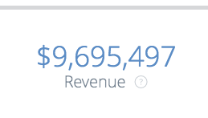
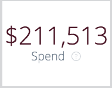
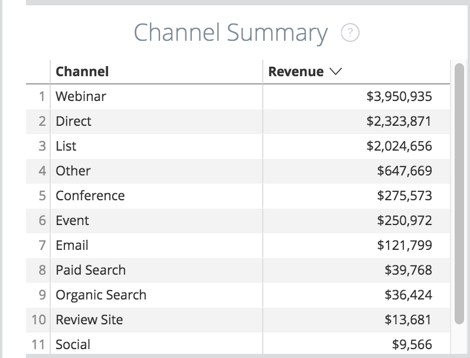

# 概觀展示板圖磚 {#overview-board-tiles}

概觀面板提供最全面性的行銷績效檢視，協助行銷團隊在發展團隊、預算或收入時做出正確決策。

<table> 
 <colgroup> 
  <col> 
  <col> 
  <col> 
  <col> 
  <col> 
  <col> 
  <col> 
  <col> 
  <col> 
  <col> 
  <col> 
 </colgroup> 
 <tbody> 
  <tr> 
   <td> </td> 
   <td>
<strong>日期型別</strong>
</td> 
   <td>
<strong>日期</strong>
</td> 
   <td>
<strong>歸因模型</strong>
</td> 
   <td>
<strong>量度</strong>
</td> 
   <td>
<strong>維度</strong>
</td> 
   <td>
<strong>管道</strong>
</td> 
   <td>
<strong>子管道</strong>
</td> 
   <td>
<strong>Campaign</strong>
</td> 
   <td>
<strong>廣告帳戶ID</strong>
</td> 
   <td>
<strong>CRM帳戶名稱</strong>
</td> 
  </tr> 
  <tr> 
   <td>
<strong>收入</strong>
</td> 
   <td><strong>X</strong></td> 
   <td><strong>X</strong></td> 
   <td><strong>X</strong></td> 
   <td> </td> 
   <td> </td> 
   <td><strong>X</strong></td> 
   <td><strong>X</strong></td> 
   <td><strong>X</strong></td> 
   <td><strong>X</strong></td> 
   <td><strong>X</strong></td> 
  </tr> 
  <tr> 
   <td>
<strong>概觀</strong>
</td> 
   <td><strong>X</strong></td> 
   <td><strong>X</strong></td> 
   <td><strong>X</strong></td> 
   <td><strong>X</strong></td> 
   <td><strong>X</strong></td> 
   <td><strong>X</strong></td> 
   <td><strong>X</strong></td> 
   <td><strong>X</strong></td> 
   <td><strong>X</strong></td> 
   <td><strong>X</strong></td> 
  </tr> 
  <tr> 
   <td>
<strong>支出</strong>
</td> 
   <td> </td> 
   <td><strong>X</strong></td> 
   <td> </td> 
   <td> </td> 
   <td> </td> 
   <td><strong>X</strong></td> 
   <td><strong>X</strong></td> 
   <td><strong>X</strong></td> 
   <td><strong>X</strong></td> 
   <td> </td> 
  </tr> 
  <tr> 
   <td>
<strong>ROI</strong>
</td> 
   <td><strong>X</strong></td> 
   <td><strong>X</strong></td> 
   <td><strong>X</strong></td> 
   <td> </td> 
   <td> </td> 
   <td><strong>X</strong></td> 
   <td><strong>X</strong></td> 
   <td><strong>X</strong></td> 
   <td><strong>X</strong></td> 
   <td><strong>X</strong></td> 
  </tr> 
  <tr> 
   <td>
<strong>交易</strong>
</td> 
   <td><strong>X</strong></td> 
   <td><strong>X</strong></td> 
   <td><strong>X</strong></td> 
   <td> </td> 
   <td> </td> 
   <td><strong>X</strong></td> 
   <td><strong>X</strong></td> 
   <td><strong>X</strong></td> 
   <td><strong>X</strong></td> 
   <td><strong>X</strong></td> 
  </tr> 
  <tr> 
   <td>
<strong>每筆交易的成本</strong>
</td> 
   <td><strong>X</strong></td> 
   <td><strong>X</strong></td> 
   <td><strong>X</strong></td> 
   <td> </td> 
   <td> </td> 
   <td><strong>X</strong></td> 
   <td><strong>X</strong></td> 
   <td><strong>X</strong></td> 
   <td><strong>X</strong></td> 
   <td><strong>X</strong></td> 
  </tr> 
  <tr> 
   <td>
<strong>Pipeline收入</strong>
</td> 
   <td><strong>X</strong></td> 
   <td><strong>X</strong></td> 
   <td><strong>X</strong></td> 
   <td> </td> 
   <td> </td> 
   <td><strong>X</strong></td> 
   <td><strong>X</strong></td> 
   <td><strong>X</strong></td> 
   <td><strong>X</strong></td> 
   <td><strong>X</strong></td> 
  </tr> 
  <tr> 
   <td>
<strong>交易規模</strong>
</td> 
   <td><strong>X</strong></td> 
   <td><strong>X</strong></td> 
   <td><strong>X</strong></td> 
   <td> </td> 
   <td> </td> 
   <td><strong>X</strong></td> 
   <td><strong>X</strong></td> 
   <td><strong>X</strong></td> 
   <td><strong>X</strong></td> 
   <td><strong>X</strong></td> 
  </tr> 
  <tr> 
   <td>
<strong>頻道摘要</strong>
</td> 
   <td><strong>X</strong></td> 
   <td><strong>X</strong></td> 
   <td><strong>X</strong></td> 
   <td><strong>X</strong></td> 
   <td> </td> 
   <td><strong>X</strong></td> 
   <td><strong>X</strong></td> 
   <td><strong>X</strong></td> 
   <td><strong>X</strong></td> 
   <td><strong>X</strong></td> 
  </tr> 
  <tr> 
   <td>
<strong>子管道摘要</strong>
</td> 
   <td><strong>X</strong></td> 
   <td><strong>X</strong></td> 
   <td><strong>X</strong></td> 
   <td><strong>X</strong></td> 
   <td> </td> 
   <td><strong>X</strong></td> 
   <td><strong>X</strong></td> 
   <td><strong>X</strong></td> 
   <td><strong>X</strong></td> 
   <td><strong>X</strong></td> 
  </tr> 
  <tr> 
   <td>
<strong>行銷活動摘要</strong>
</td> 
   <td><strong>X</strong></td> 
   <td><strong>X</strong></td> 
   <td><strong>X</strong></td> 
   <td><strong>X</strong></td> 
   <td> </td> 
   <td><strong>X</strong></td> 
   <td><strong>X</strong></td> 
   <td><strong>X</strong></td> 
   <td><strong>X</strong></td> 
   <td><strong>X</strong></td> 
  </tr> 
  <tr> 
   <td>
<strong>ROI</strong>
</td> 
   <td><strong>X</strong></td> 
   <td><strong>X</strong></td> 
   <td><strong>X</strong></td> 
   <td> </td> 
   <td><strong>X</strong></td> 
   <td><strong>X</strong></td> 
   <td><strong>X</strong></td> 
   <td><strong>X</strong></td> 
   <td><strong>X</strong></td> 
   <td><strong>X</strong></td> 
  </tr> 
  <tr> 
   <td>
<strong>ROI摘要</strong>
</td> 
   <td><strong>X</strong></td> 
   <td><strong>X</strong></td> 
   <td><strong>X</strong></td> 
   <td> </td> 
   <td><strong>X</strong></td> 
   <td><strong>X</strong></td> 
   <td><strong>X</strong></td> 
   <td><strong>X</strong></td> 
   <td><strong>X</strong></td> 
   <td><strong>X</strong></td> 
  </tr> 
 </tbody> 
</table>

## 收入圖磚 {#revenue-tile}

根據歸因模型從已結束的成功商機中歸因的總收入。

 — 商機詳細資料：顯示相關商機ID、建立日期、關閉日期、ISO代碼和收入歸因的劃分。\
 — 顯示詳細資料：依月份的劃分。

## 概覽（圖表）圖磚 {#overview-chart-tile}

圖表會顯示各管道的收入，隨時間變化而顯示。

 — 商機詳細資料：顯示相關商機ID、建立日期、關閉日期、ISO代碼和收入歸因的劃分。\
 — 顯示貢獻Opp ID的劃分：

* 依ROI周
* 依ROI資料
* 依ROI小時
* 依ROI分鐘
* 依ROI時間

## 花費圖磚 {#spend-tile}

指定時段內API成本和自我報告成本的支出總額。

>[!NOTE]
>
>在不到一個月的時間裡進行鑽研， [!DNL Marketo Measure] 將會平均該月的支出，並將該平均支出分配至每天。

 — 支出詳細資訊：顯示相關支出促銷活動唯一ID、促銷活動名稱、管道、子管道、日期、原始幣別、支出的明細。   — 顯示詳細資料：依月份的劃分。

## ROI圖磚 {#roi-tile}

從總收入（來自所選歸因模型）和總支出(收入圖磚÷支出圖磚=投資報酬率圖磚)計算的ROI （投資報酬率）。

## 交易圖磚 {#deals-tile}

顯示已歸因的交易總數（交易是已結束的成功商機的計數）。

>[!NOTE]
>
>如果選取了日期型別「接觸點日期」，則可能會進行部分計數，因為可能會有某些接觸點未落在時間範圍內。

 — 商機詳細資料：顯示相關商機ID、建立日期、結束日期和歸因（計數）的劃分。   — 顯示詳細資料：依月份的劃分。

## 每筆交易成本 {#cost-per-deal-tile}

取得一個已結束的成功機會所需的平均成本。 總支出除以交易總數(「支出磚」÷「交易磚」=每個交易磚的成本)。

## Pipeline收入圖磚 {#pipeline-revenue-tile}

未完成商機的潛在總收入

>[!NOTE]
>
>收入會反映指定的歸因模型。

 — 商機詳細資料：顯示相關商機ID、建立日期、關閉日期、ISO代碼和收入歸因的劃分。   — 顯示詳細資料：依月份的劃分。

## 交易大小拼貼 {#deal-size-tile}

已結束的成功商機的平均收入(收入拼貼÷交易拼貼=交易大小拼貼)。

## 「頻道摘要」動態磚 {#channel-summary-tile}

根據所選的量度（收入、管道收入、支出、交易、機會、潛在客戶、聯絡人）顯示管道清單。

## 子管道摘要圖磚 {#subchannel-summary-tile}

根據所選的量度（收入、管道收入、支出、交易、機會、潛在客戶、聯絡人）顯示子管道清單。

## Campaign摘要動態磚 {#campaign-summary-tile}

根據所選的量度（收入、管道收入、支出、交易、機會、潛在客戶、聯絡人）顯示促銷活動清單。

## ROI （圖表）圖磚 {#roi-chart-tile}

顯示歸因於根據所選歸因模型所選取之量度（頻道、子頻道、行銷活動、帳戶、廣告群組、廣告、廣告商、創意、關鍵字、位置、網站）的ROI。

## ROI摘要圖磚 {#roi-summary-tile}

顯示歸因於根據所選歸因模型所選取之量度（頻道、子頻道、行銷活動、帳戶、廣告群組、廣告、廣告商、創意、關鍵字、位置、網站）的ROI。

 — 商機詳細資料：顯示相關商機ID、建立日期、結束日期和歸因（計數）的劃分。

 — 顯示詳細資料：依月份的劃分。
