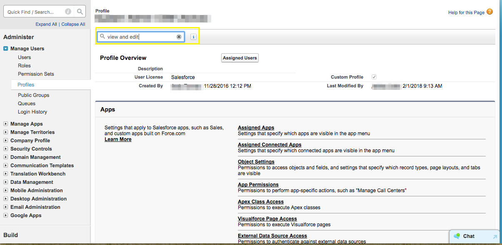

# 啟用許可權以編輯轉換的潛在客戶 {#enabling-the-permission-to-edit-converted-leads}

瞭解如何啟用許可權以編輯[!DNL Salesforce]中轉換的潛在客戶記錄。[!DNL Marketo Measure] 能夠在Salesforce中推送資料至各種物件。 推送至銷售機會時，我們發現在某些情況下，我們可能需要重新推送至已轉換的銷售機會記錄。 為了將資料推送至這些記錄，我們連線的使用者必須具有在設定檔層級檢視和編輯轉換後潛在客戶的許可權。

1. 移至[!UICONTROL Setup]並展開[!UICONTROL Manage Users]群組以選取設定檔。

   

1. 選取我們所連線之使用者的設定檔。

1. 搜尋許可權以檢視和編輯轉換的潛在客戶。

   

1. 核取方塊以啟用檢視和編輯轉換的潛在客戶的許可權。

   的許可權

而您已完成！
