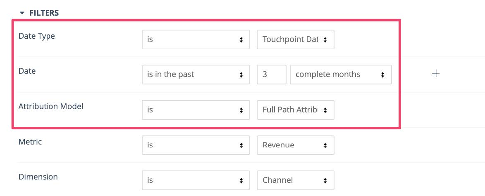
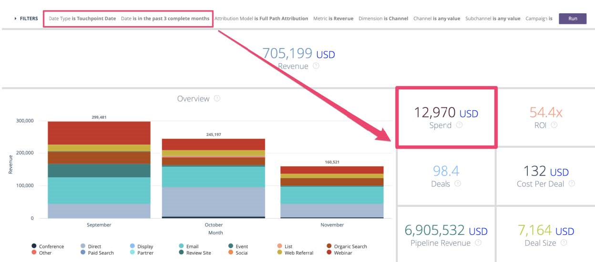

# 具有採購員接觸點的潛在客戶報表 {#leads-with-buyer-touchpoints-report}

>[!NOTE]
>
>您可能會在檔案中看到指定&quot;[!DNL Marketo Measure]&quot;的說明，但在您的CRM中仍會看到&quot;[!DNL Bizible]&quot;。 我們正致力於更新此專案，品牌重塑將很快反映在您的CRM中。

在涉及[!DNL Marketo Measure]時，您開箱即用地擁有許多報告功能，但我們建議您建立一些額外的報告型別。 瞭解如何在下方使用購買者接觸點報告型別建立內含式銷售機會。

1. 在[!DNL Salesforce]中導覽至您的設定選項。 從那裡，展開[建立]群組並選取&#x200B;**[!UICONTROL Report Types]**。

   

1. 選取「**[!UICONTROL New Custom Report Type]**」。

   

1. 將主要物件設為「銷售機會」，並在「報表型別標籤」輸入「具有購買者接觸點的銷售機會 — 包含」中設定。 將報告儲存在「銷售機會」類別中，並將部署狀態變更為&#x200B;**[!UICONTROL Deployed]**。 然後選取&#x200B;**[!UICONTROL Next]**。

   」內

1. 針對物件關係，選取&#x200B;**[!DNL Marketo Measure]人員**&#x200B;物件作為次要物件。 選取A到B的關係，因為「每個&#39;A&#39;記錄必須至少有一個相關的&#39;B&#39;記錄」。 從那裡，您將會建立「Buyer Touchpoint」物件的關係，並在B和C物件之間選取相同的關係。

   

1. 儲存並開始建立一些報告！
