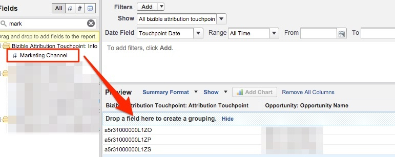

# 依據行銷管道的已關閉失去的機會 {#closed-lost-opportunities-by-marketing-channel}

雖然此報表可能會視您的機會階段而定，但此報表將揭示哪些行銷管道促成了未結束的成功機會。

1. 按一下Salesforce中的&#x200B;**[!UICONTROL Reports]**&#x200B;索引標籤並選取&#x200B;**[!UICONTROL New Report]**。

   

1. 在「Bizible歸因」中的快速尋找型別中，選取&#x200B;**[!UICONTROL Bizible Attribution Touchpoint with Opportunity]**&#x200B;報表型別，然後選取&#x200B;**[!UICONTROL Create]**。

   

1. 從報表頂端開始，顯示&quot;[!UICONTROL All Bizible Attribution Touchpoints]&quot;，並根據您要報告的時間範圍調整日期欄位。 在我們的範例中，我們會一直檢視「All Time」。 此外，將報表格式從「表格」變更為「摘要」。

   之所有Bizible歸因接觸點的報告篩選器

   

1. 現在新增欄位至報表。 在左側的快速尋找中，輸入「行銷管道」並將其新增到報表中的摘要分組。

   

1. 接下來，我們將新增篩選器，以僅檢視「已關閉的遺失的作業」。 在左側的快速尋找中，搜尋「舞台」欄位，並將其拖曳至篩選區域。

   的報告篩選器區域

1. 從那裡，您將選取放大鏡來挑選用於「已關閉的遺失」商機之任何階段。 在我們的案例中，我們將使用標準「已關閉的遺失」命名。

   ![階段篩選選擇器顯示[已關閉的遺失]階段選取選項](assets/7.jpg)

1. 現在，請繼續執行報告！

   此機會報表由行銷管道摘要，用於測量各個管道的已關閉的遺失機會。 此報表可讓您瞭解哪些管道的表現可能不佳。 歡迎您新增任何想要報告的篩選器或欄位。

>[!MORELIKETHIS]
>[[!DNL Marketo Measure] 教學課程：其他SFDC報告](https://experienceleague.adobe.com/en/docs/marketo-measure-learn/tutorials/onboarding/marketo-measure-102/addtional-salesforce-reports)
