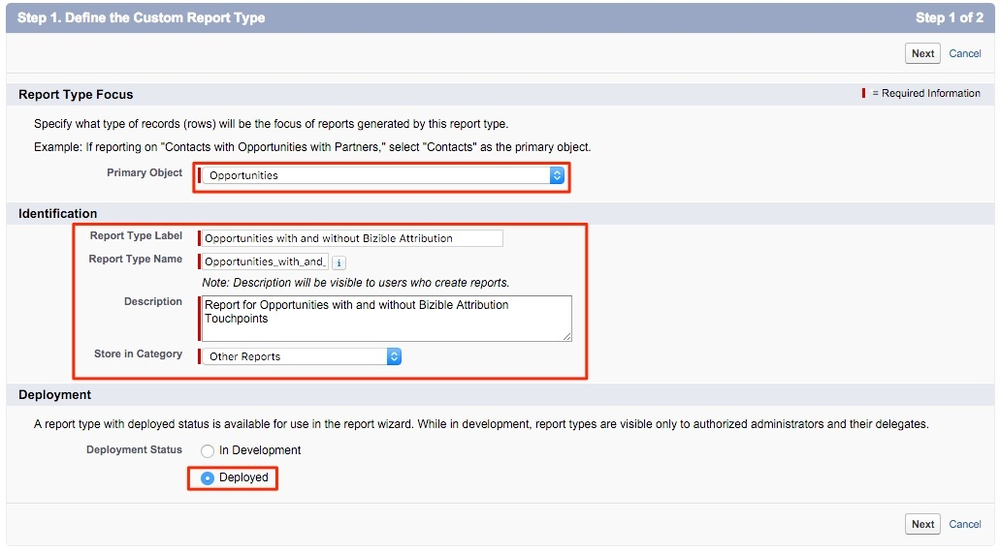

# 有或沒有購買者歸因接觸點的機會報告 {#reporting-on-opportunities-with-or-without-buyer-attribution-touchpoints}

>[!NOTE]
>您可能會在檔案中看到指定&quot;[!DNL Marketo Measure]&quot;的說明，但在您的CRM中仍會看到&quot;Bizible&quot;。 我們正致力於更新此專案，品牌重塑將很快反映在您的CRM中。

建立新的「報表型態」，以包含所有具有或不具有「採購員歸因」接觸點的商機。

1. 前往&#x200B;**[!UICONTROL Setup]** > **[!UICONTROL Create]** > **[!UICONTROL Report Types]**。

   

1. 選取「**[!UICONTROL New Custom Report Type]**」。

   

1. 將主要物件設為&quot;[!UICONTROL Opportunities]&quot;。

   * 將「報表型態標籤」命名為：「具有或不具有採購員歸因的機會」。
   * 對報表型別名稱使用相同的命名。 在說明輸入中，「是否含有購買者歸因接觸點的商機」。
   * 將報告儲存在&quot;[!UICONTROL Other]&quot;內並將報告設定為&quot;[!UICONTROL Deployed]&quot;。

   

1. 從那裡，您將會將「機會物件」連結到「購買者歸因接觸點物件」。 確保您選擇按鈕「&#39;A&#39;記錄可能有也可能沒有相關&#39;B&#39;記錄」。 完成時，按一下&#x200B;**[!UICONTROL Save]**。

   

>[!MORELIKETHIS]
>[[!DNL Marketo Measure] 教學課程：其他SFDC報告](https://experienceleague.adobe.com/zh-hant/docs/marketo-measure-learn/tutorials/onboarding/marketo-measure-102/addtional-salesforce-reports)
