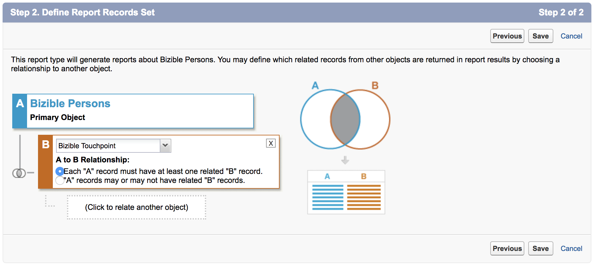
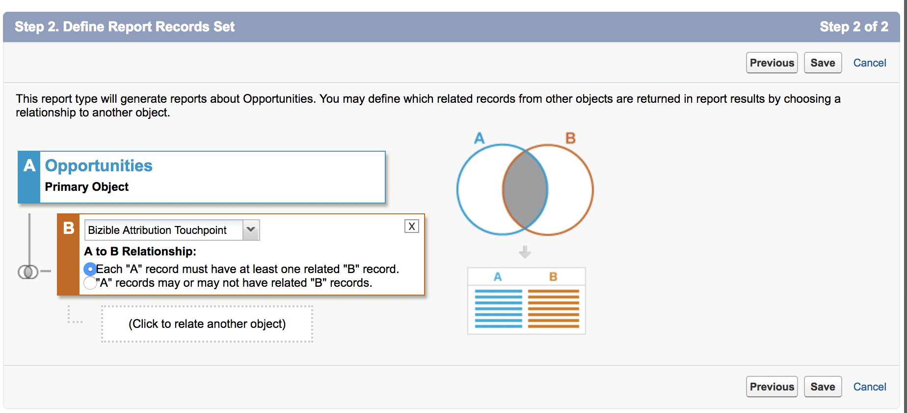
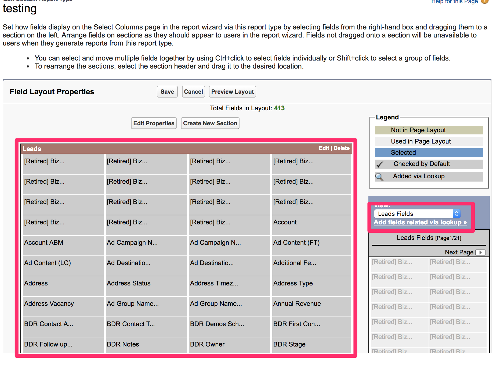

# 建立自訂[!DNL Marketo Measure]報表型別 {#creating-custom-marketo-measure-report-types}

>[!NOTE]
>
>您可能會在檔案中看到指定&quot;[!DNL Marketo Measure]&quot;的說明，但在您的CRM中仍會看到&quot;[!DNL Bizible]&quot;。 我們正致力於更新此專案，品牌重塑將很快反映在您的CRM中。

瞭解如何建立自訂[!DNL Marketo Measure] [!DNL Salesforce]報告型別。 我們建議建立三種不同的報表型別：具有購買者接觸點的銷售機會（自訂）、[!DNL Marketo Measure]具有購買者接觸點的人員（自訂）、具有Buyer Attribution Touchpoint的機會（自訂）。

## 具有購買者接觸點的銷售機會（自訂） {#leads-with-buyer-touchpoints-custom}

1. 前往「**[!UICONTROL Setup]** > **[!UICONTROL Build]** > **[!UICONTROL Report Types]** > **[!UICONTROL New Custom Report Types]**」。

   

1. 定義自訂報表型別。

   * [!UICONTROL Report Type Focus] > [!UICONTROL [!UICONTROL Primary Object]]：潛在客戶
   * 識別> [!UICONTROL Report Type Label]：具有購買者接觸點的銷售機會（自訂）
   * [!UICONTROL Store in Category]：其他報告
   * [!UICONTROL Deployment] > [!UICONTROL Deployment Status]：已部署

   

1. 定義物件關係。

   * 將Lead物件(A)與[!DNL Marketo Measure]個人物件(B)建立關聯，然後再與Buyer Touchpoint物件(C)建立關聯
   * 確定已選取&quot;[!UICONTROL Each A/B record must have at least one B/C]&quot;記錄
   * [!UICONTROL Save]

   

## [!DNL Marketo Measure]個人具有購買者接觸點（自訂） {#marketo-measure-person-with-buyer-touchpoints-custom}

1. 前往「**[!UICONTROL Setup]** > **[!UICONTROL Build]** > **[!UICONTROL Report Types]** > **[!UICONTROL New Custom Report Types]**」。

   

1. 定義自訂報表型別。

   * [!UICONTROL Report Type Focus] > [!UICONTROL Primary Object]： [!DNL Marketo Measure]人
   * [!UICONTROL Identification] > [!UICONTROL Report Type Label]： [!DNL Marketo Measure]具有購買者接觸點的人員（自訂）
   * [!UICONTROL Store in Category]：其他報告
   * [!UICONTROL Deployment] > [!UICONTROL Deployment Status]：已部署

   

1. 定義物件關係。

   * 將[!DNL Marketo Measure]個人物件(A)與Buyer Touchpoint物件(B)建立關聯
   * 確定已選取&quot;[!UICONTROL Each A record must have at least one B]&quot;記錄
   * [!UICONTROL Save]

   

## Buyer Attribution Touchpoint商機（自訂） {#opportunities-with-buyer-attribution-touchpoint-custom}

1. 前往「**[!UICONTROL Setup]** > **[!UICONTROL Build]** > **[!UICONTROL Report Types]** > **[!UICONTROL New Custom Report Types]**」。

   

1. 定義自訂報表型別。

   * [!UICONTROL Report Type Focus] > [!UICONTROL Primary Object]：機會
   * [!UICONTROL Identification] > [!UICONTROL Report Type Label]：Buyer Attribution Touchpoint商機（自訂）
   * [!UICONTROL Store in Category]：其他報告
   * [!UICONTROL Deployment] > [!UICONTROL Deployment Status]：已部署

   

1. 定義物件關係。

   * 將Opportunities物件(A)與Buyer Attribution Touchpoint物件(B)建立關聯
   * 確定已選取&quot;[!UICONTROL Each A record must have at least one B]&quot;記錄
   * [!UICONTROL Save]

   

## 新增自訂欄位至自訂報表型別 {#adding-custom-fields-to-custom-report-types}

1. 建立報表後，您將被重新導向至報表型別的概觀。 按一下「**[!UICONTROL Edit Layout]**」。

   

1. 確認您要新增至報表的自訂欄位會出現在欄位配置屬性區段中。 如果您想要新增任何其他欄位，請使用&quot;[!UICONTROL Add fields related via lookup]&quot;選項。

   
