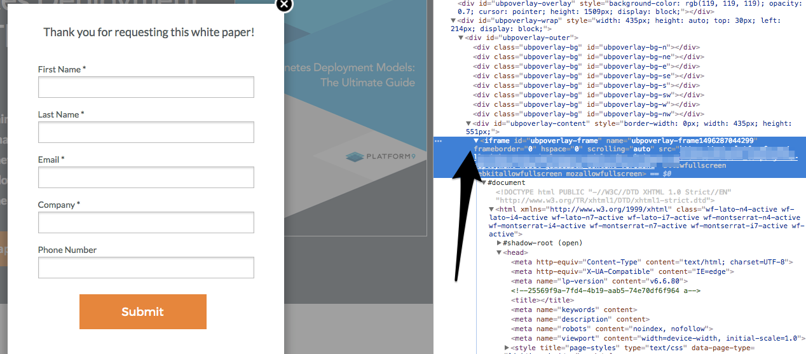
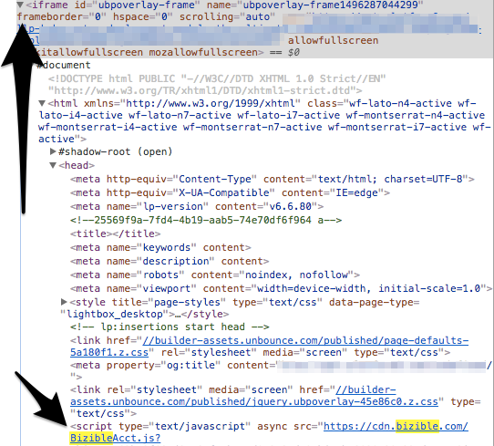

# 正在新增[!DNL Marketo Measure]指令碼至Lightbox Forms {#adding-marketo-measure-script-to-lightbox-forms}

瞭解如何將[!DNL Marketo Measure] JavaScript正確新增至Lightbox中的表單。

當訪客執行特定動作（即按一下頁面的特定部分、在頁面上花費特定時間等）時，燈箱會在您的內容前面開啟表單。 通常我們會要求將[!DNL Marketo Measure] JavaScript放置在登入頁面的開頭，但若是燈箱中的表單，則需要額外的步驟。

由於Lightbox中的表單基本上是iFrame中的表單，因此指令碼會放置在該iFrame中。

首先，找到[!UICONTROL lightbox]表單所在的iFrame。

接下來，將[!DNL Marketo Measure] JavaScript放在iFrame中。

最後，新增JavaScript時，會依照下列指示追蹤驗證表單提交：

1. 複製包含[!UICONTROL lightbox]表單之登入頁面的URL。
1. 開啟無痕瀏覽器並貼上URL。
1. 使用唯一的電子郵件地址提交表單。
1. 檢查您的CRM是否有使用的唯一電子郵件地址，以確認是否已追蹤測試，並確定已填入接觸點資料。
