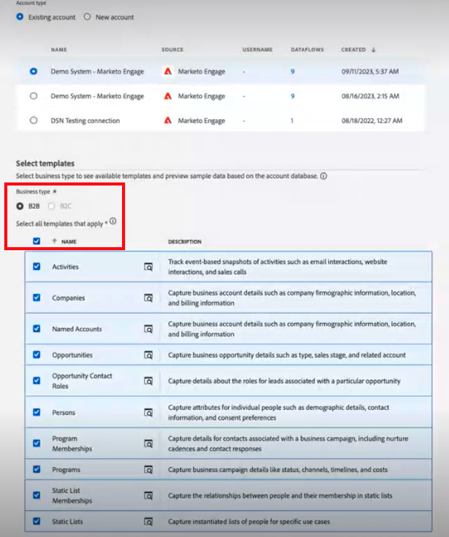

# [!DNL Marketo Measure] Ultimate Implementation指南 {#marketo-measure-ultimate-implementation-guide}

本文可作為Marketo Measure Ultimate的實作指南，提供清晰的步驟和深入分析，以確保成功的整合和使用。

## 使用Ultimate層級與標準層級的主要差異 {#main-differences-when-using-ultimate-over-standard-tiers}

透過AEP匯入B2B資料：行銷人員應透過AEP匯入B2B資料（例如帳戶、機會、聯絡人、銷售機會、促銷活動、促銷活動成員、活動）。 從幾乎任何資料來源以及相同型別的多個資料來源擷取，以匯入所有資料進行歸因。

* 與幾乎任何CRM搭配使用，不只是Salesforce和Dynamics。
* 將多個CRM執行個體和/或MAP執行個體連線到一個Marketo Measure執行個體。
* 引進協力廠商網路研討會註冊和參與率資料。

Ultimate不再提供直接CRM和Marketo Engage連線。

* Ultimate不會將資料推送回CRM。 客戶可使用資料倉儲中的資料。
* 行銷人員將繼續透過Marketo Measure javascript透過直接連線和追蹤網頁活動引入廣告平台資料。

最終使用者將布建為AEP。 如果他們已有AEP，我們將不會重新布建新執行個體。

* 布建的AEP版本將僅包含所有來源聯結器、結構描述資料模型、資料集、Ad Hoc Query Service和Marketo Measure目的地。

進一步瞭解 [Marketo Measure Ultimate](/help/marketo-measure-ultimate/marketo-measure-ultimate-overview.md){target="_blank"}.

## 結構描述和資料集 {#schemas-and-datasets}

>[!NOTE]
>
>簽出 [結構描述的建置區塊](https://experienceleague.adobe.com/docs/experience-platform/xdm/schema/composition.html?lang=en#building-blocks-of-a-schema){target="_blank"} 以取得結構描述、類別和欄位群組的概觀。

**XDM結構描述=類別+結構描述欄位群組&#42;**

* 必填欄位不可變更。 客戶可視需要建立和新增自訂欄位。
* 根據階層的欄位名稱範例： accountOrganization.annualRevenue.amount

&#42; _結構描述包含一個類別和零個或多個結構描述欄位群組。 這表示您可以在不使用欄位群組的情況下撰寫資料集結構。_

[資料集總覽](https://experienceleague.adobe.com/docs/experience-platform/catalog/datasets/overview.html){target="_blank"}：所有成功內嵌至AEP的資料都會以資料集的形式保留在資料湖中。 資料集是資料集合的儲存和管理結構，通常是包含方案（欄）和欄位（列）的表格。

## 建立結構描述 {#creating-a-schema}

我們建議使用自動產生公用程式來建立10個標準B2B結構描述。

* 下載及設定公用程式的步驟 [可在此處找到](https://experienceleague.adobe.com/docs/experience-platform/sources/connectors/adobe-applications/marketo/marketo-namespaces.html#set-up-b2b-namespaces-and-schema-auto-generation-utility){target="_blank"}.

適用於具有 _**CDP權益**_：前往來源頁面建立方案。

* 從來源中，選取新增資料>使用範本

* 選取一個帳戶和所有B2B範本，以建立10個標準B2B結構描述。

## 資料流程 {#dataflows}

[資料流概觀](https://experienceleague.adobe.com/docs/experience-platform/dataflows/home.html){target="_blank"}

**建立資料流的步驟：**

1. 選取來源。
1. 選取現有帳戶或建立帳戶。
1. 從可用型別清單中選取資料型別，以從「來源」匯入。
1. 選取現有資料集或建立新資料集。
1. 將來源中的欄位對應到結構描述。

   >[!NOTE]
   >
   >* 如果您將一個結構描述型別對應到另一個相同的結構描述型別，則會自動完成對應作業。
   >* 您也可以從系統中的另一個流程匯入對應。
   >* 您可以將一個「來源」欄位對應到多個目的地欄位，但無法反其道而行之。
   >* 您可以建立計算欄位([資料準備對應函式](https://experienceleague.adobe.com/docs/experience-platform/data-prep/functions.html){target="_blank"})。

   >[!CAUTION]
   >
   >* 您可以編輯資料流，但在變更對應時不會回填資料。
   >* 如果必填欄位為NULL，則會拒絕整個流程。

   >[!NOTE]
   >
   >[Marketo Measure Ultimate資料完整性需求](/help/marketo-measure-ultimate/data-integrity-requirement.md){target="_blank"}

1. 設定資料載入節奏。
1. 檢閱並完成。
1. 請檢視測量使用者介面設定中的「帳戶狀態」頁面，瞭解資料流狀態。

**監視：**

來源>資料流頁面以檢查資料流的狀態

* 若要檢視資料集的活動詳細資料，只要按一下資料集即可。
* 若要檢視資料流錯誤，請選取資料流、選擇資料流執行，然後按一下「錯誤診斷預覽」。

## 資料檢查 {#data-inspection}

選項1：若要直接從UI執行查詢，請存取資料管理下的查詢索引標籤。

選項2： [下載和使用PSQL](https://experienceleague.adobe.com/docs/experience-platform/query/clients/psql.html){target="_blank"} （更快速、更可靠）。

## 啟動Marketo Measure的資料集 {#activate-dataset-for-marketo-measure}

開始之前，請前往「測量UI設定」中的「Experience Platform>沙箱對應」區段，並對應沙箱。

>[!CAUTION]
>
>選取後即無法變更。

1. 在AEP中，前往「目的地> Marketo Measure頁面」以匯出資料集。
1. 設定目的地。
1. 啟動資料集。
1. 請檢視測量使用者介面設定中的「帳戶狀態」頁面，瞭解資料流狀態。

>[!NOTE]
>
>* 來自指定來源之指定實體（例如帳戶）的資料只能進入一個資料集。 每個資料集只能包含在一個資料流程中。 違規會在執行階段停止資料流。
>* 刪除AEP中的整個目的地，以刪除「測量」中的資料。 停用只會停止匯出新資料並保留舊資料。
>* 「測量」組態看起來大多相同，但有些零件（例如「階段對應」）看起來會不同。
>* 新資料流需要幾個小時才能產生資料流執行，然後會以固定的每小時間隔進行。

在測量中，預設貨幣必須在「貨幣」區段中設定

* 如果您使用多貨幣，則必須在AEP中填入貨幣轉換率結構描述，我們才能讀取及使用它進行轉換。

**階段對應：**

我們不會自動從使用者資料匯入階段，因此所有階段都必須手動對應。

* 使用者可以從不同的來源對應階段。

如果階段未對應，系統將無法運作，因為沒有資料可移去。

如果您是Marketo Measure Ultimate客戶，並將您的預設控制面板物件設定為Contact，請勿使用下列兩個特定於Lead的欄位([在此處瞭解更多](/help/marketo-measure-ultimate/data-integrity-requirement.md){target="_blank"})。

* b2b.personStatus
* b2b.isConverted

**促銷活動成員規則：**

需要挑選資料集，並為每個資料集設定規則。

**體驗事件規則：**

需要挑選資料集並選取活動型別。

* 尚未支援自訂活動。
* 如果客戶的活動不符合可用選項，我們建議將其分類為「有趣的時刻」，並使用自訂欄位加以區分。

**離線頻道：**

* 我們不會執行資料集專用的管道對應規則，因此這將是全域性的。
* 我們最終需要比對CRM行銷活動型別和管道，但目前我們可以將管道名稱對應到兩個欄位作為因應措施。
* **管道規則：回填的資料沒有階段轉換資料。**

接觸點和區段設定維持不變。
