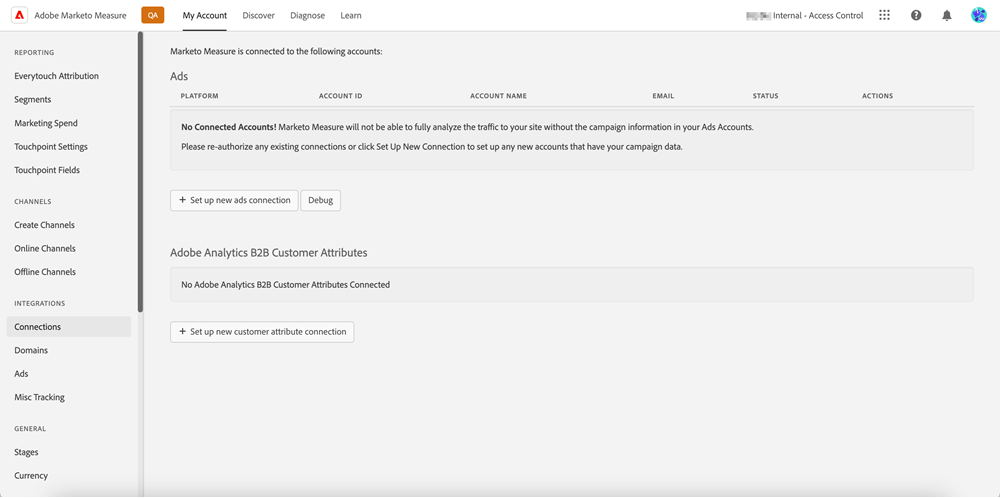
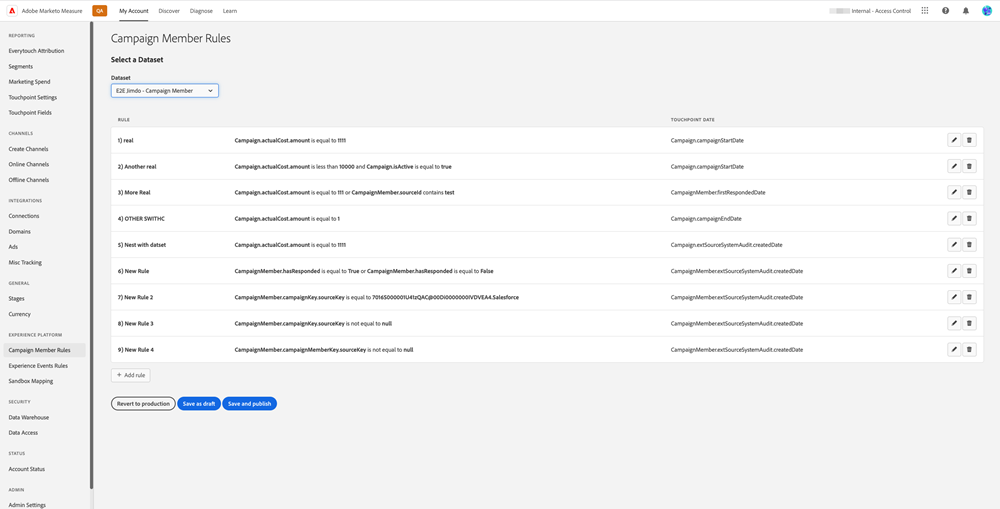

# [!DNL Marketo Measure] Ultimate概觀 {#marketo-measure-ultimate-overview}

[!DNL Marketo Measure] （前身為Bizible）可協助行銷人員深入瞭解哪些行銷手法最能有效提升公司營收，實現投資報酬最大化。 [!DNL Marketo Measure]是行銷歸因解決方案，可自動追蹤並報告管道效能，讓您可見哪些管道可推動最多客戶參與，並據此將行銷支出最佳化。

[!DNL Marketo Measure Ultimate]包含其他功能：

* 從幾乎所有資料來源和相同型別的多個資料來源擷取，以匯入所有資料進行歸因。
   * 與幾乎任何CRM搭配使用，不只是Salesforce和Dynamics。
   * 將多個CRM執行個體和/或MAP執行個體連線到一個[!DNL Marketo Measure]執行個體。
   * 引進協力廠商網路研討會註冊和參與率資料。

* 透過欄位對應和轉換功能，以極大的彈性轉換資料，確保正確的資料形狀。

* 透過包含的資料倉儲，讓外部應用程式可使用歸因深入分析，將深入分析整合至您的工作流程中。 更精細的結果資料和BI型報表，包括SnowflakeData Warehouse，可存取精細的結果資料，以及使用任何BI工具進行分析和報表的功能。

* 與RTCDP （B2B或B2P版本）整合，為RTCDP客戶提供整合式B2B歸因解決方案，因為RTCDP和[!DNL Marketo Measure]都可從集中式Adobe Experience Platform (AEP)資料運作。

**[!DNL Marketo Measure]層級1-3**

**[!DNL Marketo Measure Ultimate]**

## [!DNL Marketo Measure Ultimate]的新增功能 {#whats-new-in-marketo-measure-ultimate}

**透過AEP匯入B2B資料**

行銷人員應透過AEP匯入其B2B資料（例如，帳戶、商機、聯絡人、銷售機會、促銷活動、促銷活動會員、活動）。 Ultimate不再提供直接CRM和Marketo Engage連線。 行銷人員繼續透過直接連線引進廣告平台資料，並透過[!DNL Marketo Measure] JavaScript追蹤網頁活動。

**預設貨幣設定**

[!DNL Marketo Measure Ultimate]將預設貨幣設定為USD，直到使用者變更為止。 設定新的預設貨幣會更新資料，而不會重新處理。 只要選取的貨幣以目標ISO代碼的形式存在，就不需要提交轉換率。

**[!DNL Marketo Measure Ultimate]沙箱**

在AEP中建立[!DNL Marketo Measure]目的地資料流程之前，[!DNL Marketo Measure Ultimate]執行個體必須對應至AEP沙箱。

>[!NOTE]
>
>[!DNL Marketo Measure Ultimate]生產執行個體必須對應至AEP生產沙箱，而[!DNL Marketo Measure Ultimate]開發人員執行個體必須對應至AEP開發人員沙箱。

一旦沙箱對應選擇儲存後，您就無法在應用程式中變更它。 若要變更，請連絡[Marketo支援](https://nation.marketo.com/t5/support/ct-p/Support){target="_blank"}。

來自指定資料來源之指定實體（例如帳戶）的資料只能進入一個資料集。 每個資料集只能包含在一個資料流程中。 違規會在執行階段停止資料流。

**階段對應**

所有[!DNL Marketo Measure Ultimate]規則都是資料集專屬規則。 必須為所有資料集和所有選取的階段建立階段對應規則。

內建階段共有六個：

* 潛在客戶已遺失
* 潛在客戶開啟
* 潛在客戶已轉換
* 機會遺失
* 商機已開啟
* 已贏得機會

「失敗」、「成功」和「已轉換」區段不允許自訂階段。 不過，您可以更新對應規則，將Source資料對應至內建的「失敗/成功/已轉換」階段。

只能為「開啟」區段定義自訂階段。
我們不再自動在階段對應上包含CRM階段。

四個內建階段必須使用規則對應（其他兩個階段的對應規則為選擇性，即「銷售機會遺失」與「銷售機會轉換」）：

* 潛在客戶開啟
* 機會遺失
* 商機已開啟
* 已贏得機會

規則條件為資料集所專屬。 必須針對所有資料集和所有階段（「銷售機會遺失」和「銷售機會已轉換」除外）建立階段對應規則。

沒有漏斗、迴旋鏢、自訂模型的選擇。 漏斗、迴旋鏢和自訂模型會選取所有階段。 我們支援的階段數量有所限制：15個自訂階段加6個內建階段。

Campaign成員接觸點規則和活動接觸點規則是資料集專屬規則。

歸因接觸點不會寫入CRM，因為Ultimate沒有直接CRM連線。

[!DNL Marketo Measure] ABM ML服務（銷售線索與帳戶的比對與預測性參與分數）不適用於[!DNL Marketo Measure Ultimate]。 RT-CDP B2B版本中會免費提供這類服務。

## 限制 {#limitations}

* 資料轉換規則可用的欄位有限。
* 現有第1/2/3層使用者沒有移轉路徑。 需要新的實施，但我們會協助從現有執行個體移轉追蹤的網頁活動資料。

>[!MORELIKETHIS]
>
>[Marketo Measure Ultimate目的地](https://experienceleague.adobe.com/docs/experience-platform/destinations/catalog/adobe/marketo-measure-ultimate.html?lang=en){target="_blank"}
