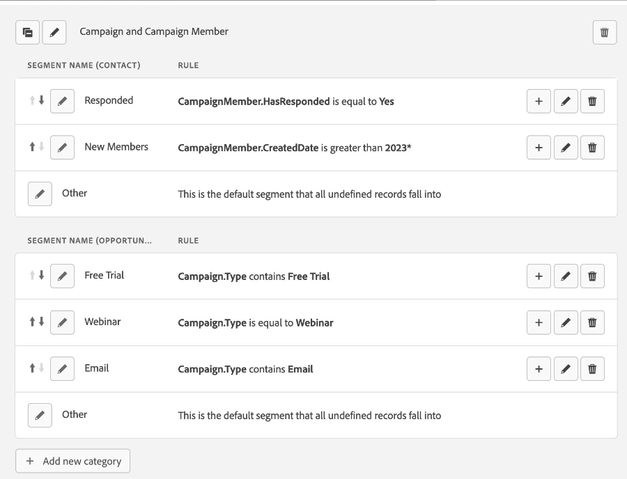

# 發行說明：2024年 {#release-notes-2024}

請參閱下文，瞭解2024年發行版本的所有新功能和更新功能。

## 第4季發行 {#q4-release}

### 新工作階段管道結轉行為

如果新工作階段在閒置30分鐘後的7天內開始，則上一個工作階段的管道現在會結轉，僅套用至直接造訪（無反向連結或內部反向連結）。 七天未使用後，工作階段會預設為「直接/其他」。 先前的工作階段資料不會覆寫非直接管道。

此外，使用社交登入(Google、Microsoft或Apple)的工作階段現在已合併為一個連續的的工作階段，以確保更順暢的體驗。 如果沒有此傳遞切換，社交登入會因外部反向連結差異而建立個別的工作階段。

對於新客戶，工作階段管道結轉現在是預設行為。 現有客戶可透過在「設定>每次接觸歸因」下開啟「工作階段管道結轉」切換來啟用此功能。 此設定一經啟用即無法復原。

檔案： [Marketo Measure Web工作階段定義](https://experienceleague.adobe.com/zh-hant/docs/marketo-measure/using/marketo-measure-tracking/setting-up-tracking/definition-of-marketo-measure-web-sessions){target="_blank"}

### 關鍵字ROI控制面板

新的關鍵字ROI儀表板提供付費搜尋行銷活動績效的詳細深入分析，提供關鍵字層級成本、已歸因收入以及產生的潛在客戶和商機的完整檢視。 此儀表板可協助您評估Google Adwords、LinkedIn和Bing Ads等產品的每個關鍵字投資報酬率。

檔案： [關鍵字ROI儀表板](https://experienceleague.adobe.com/zh-hant/docs/marketo-measure/using/marketo-measure-discover-ui/dashboards/keyword-roi-dashboard){target="_blank"}

### 增強型區段規則

除了「接觸點」和「聯絡人」欄位外，您現在可以使用「促銷活動」和「促銷活動成員」欄位建立區段。 此增強功能可讓您在Discover中更有效地分析和剖析資料。

### 更新： CRM匯出的錯誤處理設定

我們聽取了您對於停止工作方法的意見反應，並將在使用者介面中推出新功能。 從今天開始，您可以選擇發生錯誤時是否應該暫停匯出工作。 在&#x200B;**我的帳戶** > **設定** > **CRM** > **一般**&#x200B;中使用新的切換按鈕。 此開關預設為開啟，以增強資料完整性和可見性。 但是，如果您不想使用此功能，可以在UI中將其關閉，匯出作業將繼續。 此更新旨在增強資料管理流程的可靠性，同時讓您擁有更優異的控制力。

#### 主要日期和分階段推出

1. **立即切換可用性：**&#x200B;此切換現在在UI中是即時的，並且預設為啟用，以防止在匯出作業期間略過資料。 如果您偏好匯出作業在遇到錯誤時仍繼續執行，請停用切換按鈕。

1. **工作暫停啟用於10月1日：**&#x200B;自2024年10月1日起，如果切換作用中且在匯出工作期間發生記錄層級錯誤，工作會暫停以確保沒有資料遺失。 這些錯誤通常是因為缺少許可權、未正確套用自訂驗證規則，或工作流程/觸發程式中有問題。 您將會收到有關問題的通知，問題修正後，匯出作業將從中斷點恢復。 如果您選擇退出工作暫停，您仍會收到問題通知，當問題得到更正時，跳過的記錄會自動重新匯出。

#### 這很重要的原因

* **加強資料完整性和未來防護您的整合：**&#x200B;透過在問題第一次出現時暫停工作，我們可防止資料遺失並確保準確性。 如此可迅速解決錯誤，進而改善資料匯出品質和整體系統可靠性。

* **立即可見：**&#x200B;透過脈衝通知，您將會收到許可權錯誤的即時警示，允許立即回應，並將對您作業的潛在影響降到最低。

#### 支援您的轉變

為協助您適應這項變更，我們已建立新功能的相關檔案，並透過完整的疑難排解步驟來清除錯誤說明。

* 新檔案： [處理CRM匯出的設定時發生錯誤](/help/configuration-and-setup/marketo-measure-and-salesforce/crm-error-handling.md)
* [錯誤通知](/help/configuration-and-setup/getting-started-with-marketo-measure/error-notifications.md)

## 第3季發行 {#q3-release}

### 提醒： Salesforce欄位淘汰 — 6月14日

如去年所宣佈，我們將[逐步淘汰匯出至Lead/Contact物件的工作](https://nation.marketo.com/t5/employee-blogs/marketo-measure-salesforce-lead-and-contact-field-deprecation-06/ba-p/350179){target="_blank"}，以簡化整合，並免除匯出至Salesforce標準物件的需求。 您可以依照此處說明的步驟[從接觸點物件取得相同的資料](/help/release-notes/previous-releases/2023.md#deprecations){target="_blank"}。 我們也會分享有關建立工作流程的檔案，以將此資料新增至銷售機會/聯絡人物件。 淘汰將於2024年6月14日生效。

此變更將帶來兩個主要優點：

* **降低Salesforce API成本**：客戶可預期將其Salesforce API成本降低約10%。
* **簡化整合**：我們的匯出工作中的錯誤數目最多與這些程式有關。 移除這些元素將大幅簡化我們的整合。

### 已歸因的機會儀表板

我們很高興介紹全新的[已歸因的機會儀表板](/help/marketo-measure-discover-ui/dashboards/attributed-opportunity-dashboard.md){target="_blank"}，其設計可讓您全面瞭解您的行銷工作如何對新興和成熟的管道機會作出貢獻。 此儀表板可讓您深入瞭解歸因於您策略的每個開啟和關閉商機的詳細資訊，並靈活地按商機階段篩選。 它提供哪些管道、子管道或行銷活動在歸因商機金額方面排名最高的深入分析，並顯示歸因商機金額總計以及歸因的未完成與已結束商機計數。

### 適用於Marketo Measure Ultimate的Marketo EngageCookie同步

Marketo Measure Ultimate現在提供Marketo EngageCookie同步功能。 若要使用此功能：

1. 在「AEP綱要」頁面上，編輯「B2B人員」綱要，並新增欄位群組「Marketo Engage人員詳細資訊」。
1. 將資料內嵌至MMU時，請將欄位群組中的Cookie ID欄位對應至Marketo Engage中的Cookie欄位。

### 為第2級客戶啟用回溯階段功能

以前只有第3級客戶可以使用Boomerang Stage功能，但自2024年6月13日起，所有第2級客戶也可以使用。 如需有關此功能的詳細資訊，請參閱以下檔案。

* [回溯階段與接觸點](/help/advanced-marketo-measure-features/boomerang/boomerang-stages-and-touchpoints.md){target="_blank"}
* [正在設定迴旋移動階段](/help/advanced-marketo-measure-features/boomerang/setting-up-boomerang-stages.md){target="_blank"}
* [Boomerang階段案例](/help/advanced-marketo-measure-features/boomerang/boomerang-stage-scenarios.md){target="_blank"}

## 第2季發行 {#q2-release}

### 第三方Cookie淘汰後淘汰Marketo Measure功能

為回應日益增長的隱私權顧慮，第三方Cookie正在逐步淘汰，Google Chrome於2024年第三季的最後期限表示淘汰。 Marketo Measure將淘汰依賴第三方Cookie的某些功能，尤其是跨網域追蹤和瀏覽歸因，這些依賴於Google/DoubleClick曝光數Cookie。 此變更不會影響其他Marketo Measure功能或第一方Cookie的使用。 根據Google的時間表，這些功能預計在6月1日前淘汰，不過客戶仍然可以存取在此日期之前收集的資料。

* [在Marketo Measure中調整為使用第三方Cookie](https://nation.marketo.com/t5/employee-blogs/adapting-to-third-party-cookie-deprecation-in-marketo-measure/ba-p/345110){target="_blank"}
* [Marketo Measure Cookie](/help/marketo-measure-tracking/setting-up-tracking/marketo-measure-cookies.md){target="_blank"}

### 分階段推出我們的增強錯誤處理

我們將分階段推出匯出工作的增強錯誤處理功能，從許可權錯誤的立即應用程式內脈衝通知開始，並轉換到匯出工作將在錯誤點暫停的新方式。 這項變更旨在改善資料完整性和可見度，確保使用者有更流暢、更可靠的資料管理流程。 為確保順利轉換並將營運中斷降至最低，我們分兩個階段實作這些變更：

* Pulse通知的立即可用性：在匯出作業期間，您將收到有關許可權錯誤的應用程式內脈衝通知。 這不會中斷您的匯出，但可協助您瞭解錯誤，而不會影響您目前的工作。
* 4月25日暫停工作實作： **已延後** — 在考慮Marketo Measure使用者的意見回饋後，我們決定在發生錯誤時延遲暫停匯出工作的實作，原定於4月25日執行。 我們瞭解暫停工作可能不是最有效率的方法。 我們致力於尋找更好的解決方案，以維持資料完整性並儘量減少中斷。 在可確保解決方案更符合使用者的需求之前，我們不會對目前的系統進行任何變更。

_這很重要的原因_

增強資料完整性和前瞻性您的整合：我們會在第一次出現問題跡象時停止工作，以防止資料遺失並確保準確性。 這有助於快速解決問題，改善資料匯出品質和系統可靠性。

立即可見：引入脈衝通知可讓您對許可權錯誤做出即時回應，避免對作業造成潛在影響。

_支援您的轉換_

為協助您適應這項變更，[我們已建立檔案](/help/configuration-and-setup/getting-started-with-marketo-measure/error-notifications.md){target="_blank"}，其中包含明確的錯誤說明和完整的疑難排解步驟。

 

### linkedIn整合所需動作

linkedIn最近發佈了其Lead Sync API的更新版本。 請在5月20日前重新驗證Marketo Measure執行個體中的LinkedIn連線，以避免任何服務中斷。
