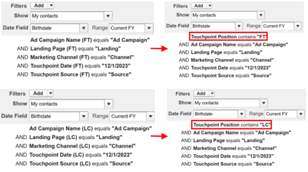
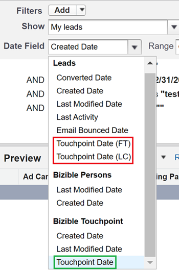

# 發行說明：2023年 {#release-notes-2023}

請參閱下文，瞭解2023年發行版本的所有新功能和更新功能。

## 第4季發行 {#q4-release}

**網站流量儀表板**

全新重新設計的 [網站流量儀表板](/help/marketo-measure-discover-ui/dashboards/web-traffic-dashboard.md){target="_blank"} 現在可供所有客戶存取。 此儀表板提供網站訪客互動的完整總覽。 您可以分析量度，例如每個URL的不重複訪客計數、整體造訪、頁面檢視，以及來自特定表單URL或登入頁面的表單提交。 您也可以追蹤每月流量趨勢，並找出高績效的付費媒體，協助您調整策略以取得最佳收入。

全新預先建立控制面板組合已排程分階段推出，於年底前完成。

>[!NOTE]
>
>雖然目前的控制面板將於2024年3月汰除，您仍可使用兩個版本，確保順利轉換。

**IP位址資料移除**

我們將從長期儲存空間中移除IP位址資料，以確保資料隱私權法規遵循。 目前，下列Snowflake表格和檢視包含IP位址，我們計畫移除此資料並新增地理位置資訊：

<table style="width:400px">
<thead>
  <tr>
    <th style="width:50%">表格</th>
    <th>檢視</th>
  </tr>
</thead>
<tbody>
  <tr>
    <td>CUSTOMER_AB_TESTS</td>
    <td>BIZ_CUSTOMER_AB_TESTS</td>
  </tr>
  <tr>
    <td>CUSTOMER_EVENTS</td>
    <td>BIZ_CUSTOMER_EVENTS</td>
  </tr>
  <tr>
    <td>FORM_SUBMIT</td>
    <td>BIZ_FORM_SUBMIT</td>
  </tr>
  <tr>
    <td>曝光數</td>
    <td>商業曝光數(_I)</td>
  </tr>
  <tr>
    <td>PAGE_VIEWS</td>
    <td>BIZ_PAGE_VIEW</td>
  </tr>
  <tr>
    <td>工作階段</td>
    <td>商務工作階段</td>
  </tr>
  <tr>
    <td>WEB_HOST_MAPPINGS</td>
    <td>BIZ_WEB_HOST_MAPPINGS</td>
  </tr>
</tbody>
</table>

* 從現在開始，我們將下載「國家/地區代碼」、「城市名稱」和「地區代碼」，而非「國家/地區名稱」、「城市名稱」和「地區名稱」。
* 在處理所有歷史網路活動期間，可能會出現記錄位置資訊不一致的情況。 這些不一致之處可能包括存在的IP位址沒有地理位置詳細資訊、更新的地理位置資訊沒有IP位址，或國家或地區名稱和代碼的混合。
* _**此混合資料期間預計從2023年1月4日到2023年2月29日。**_

**URL表格中的頁面標題資料**

中的URL表格 [資料倉儲](/help/marketo-measure-data-warehouse/data-warehouse-schema.md){target="_blank"} 除了Web資料表格外，現在還將包含頁面標題欄位。

請注意，URL表格中的頁面標題可能並不一定與其他網頁表格中的頁面標題相符。 URL表格將會有最近的頁面標題。 如果網頁活動發生後URL的標題已變更，它將不會符合URL表格中的內容。

**探索儀表板重新設計**

所有Marketo Measure使用者都會體驗我們重新設計的應用程式內儀表板，不但可用性增強，價值也大幅提升。 我們也引進了新的量度，例如「實現的投資報酬率」，此量度會考量到行銷投資與B2B進入市場購買之間的典型延遲。

新的預先建立控制面板集合已排定分階段推出，於10月的第一週開始，並在年底前結束。 這些新控制面板連同產品內資訊和檔案連結會自動顯示在您的執行個體中。

* [新增Discover儀表板指南](/help/marketo-measure-discover-ui/dashboards/new-discover-dashboard-guide.md){target="_blank"}
* [探索儀表板基本知識](/help/marketo-measure-discover-ui/dashboards/discover-dashboard-basics.md){target="_blank"}
* [收入總覽儀表板](/help/marketo-measure-discover-ui/dashboards/revenue-overview-dashboard.md){target="_blank"}
* [已歸因的收入儀表板](/help/marketo-measure-discover-ui/dashboards/attributed-revenue-dashboard.md){target="_blank"}
* [ROI控制面板](/help/marketo-measure-discover-ui/dashboards/roi-dashboard.md){target="_blank"}
* [Passport儀表板](/help/marketo-measure-discover-ui/dashboards/passport-dashboard.md){target="_blank"}

>[!NOTE]
>
>雖然目前的控制面板將於2024年3月汰除，您仍可使用兩個版本，確保順利轉換。

### 淘汰 {#deprecations}

#### Salesforce欄位淘汰

我們將逐步淘汰匯出至Lead/Contact物件的工作，以簡化整合，並免除匯出至Salesforce標準物件的需要。 下列非正規化欄位也會遭到取代，因為客戶可以從其接觸點物件取得相同的資料。 _**淘汰的時間表為2024年6月。**_

<table style="width:350px">
<tbody>
  <tr>
    <td>bizible2__Ad_Campaign_Name_FT__c</td>
  </tr>
  <tr>
    <td>bizible2__Ad_Campaign_Name_LC__c</td>
  </tr>
  <tr>
    <td>bizible2__Landing_Page_FT__c</td>
  </tr>
  <tr>
    <td>bizible2__Landing_Page_LC__c</td>
  </tr>
  <tr>
    <td>bizible2__Touchpoint_Date_FT__c</td>
  </tr>
  <tr>
    <td>bizible2__Touchpoint_Date_LC__c</td>
  </tr>
  <tr>
    <td>bizible2__Touchpoint_Source_FT__c</td>
  </tr>
  <tr>
    <td>bizible2__Touchpoint_Source_LC__c</td>
  </tr>
  <tr>
    <td>bizible2__Marketing_Channel_FT__c</td>
  </tr>
  <tr>
    <td>bizible2__Marketing_Channel_LC__c</td>
  </tr>
</tbody>
</table>

在接觸點和歸因接觸點物件中包含相同資訊的欄位包括：

* bizible2__Ad_Campaign_Name__c
* bizible2__Landing_Page__c
* bizible2__Marketing_Channel__c
* bizible2__Touchpoint_Date__c
* bizible2__Touchpoint_Source__c

**必要動作**

* 為具有或不具有接觸點的銷售機會和聯絡人建立新的報告型別。

* 建立可擷取任何現有報告（其使用已移除的欄位）功能的報告。 在此程式中，您將需要變更報表中的欄位，如下所示：

* 移除銷售機會/聯絡人FT/LC欄位：

* 新增接觸點欄位：

* 「接觸點位置」篩選器以及任何使用FT/LC欄位（包括「日期」欄位）的篩選器，都應更新如下：

* 刪除任何使用潛在客戶/連絡人物件中移除欄位的預先存在報告，以不再參考這些欄位。

#### Dynamics套件相關

* 若要保持與Dynamics的連線，請安裝最新套件版本v6.12。舊版 `(<v6.12)` 將不再受支援。 此更新會最佳化歷史記錄的建立，以減少儲存空間使用量。

* 將棄用具有RefreshToken的過時方法OAuth。 請參閱 [本指南](/help/marketo-measure-and-dynamics/getting-started-with-marketo-measure-and-dynamics/oauth-with-azure-active-directory-for-dynamics-crm.md){target="_blank"} 更新您的認證，以遵守Microsoft使用ClientSecret的最佳做法。

#### 「custom_properties」欄位

在我們Data Warehouse中，「custom_properties」欄位一直是固定結構描述未涵蓋之其他資料點的儲存空間。 此欄位以JSON格式儲存，其使用方式有限，而且與SQL查詢的整合可能會很複雜，從而影響效能。 基於這些因素，我們決定棄用此欄位。 此變更主要影響Azure表格儲存空間中的資料處理層，以及匯出至資料倉儲的資料。

### 即將推出的功能 {#q4-whats-coming}

**應用程式內自訂報告**

Marketo Measure客戶第一次能夠直接在應用程式中建立和儲存自己的報表。 我們於2024年初發行預先建立的儀表板後開始進行這項作業。

 

## 第2季發行 {#q2-release}

* **Salesforce封裝合併**

我們將所有Salesforce套件合併為單一、完整的套件，以提升使用者體驗並簡化使用程式。 V1、V2_EXT及Reporting套裝軟體將於下季淘汰。 新的套件結合了所有先前的功能，允許更高效的追蹤和更深入的客戶分析。

已安裝V2套件的客戶必須將其更新至新的整合版本。

我們已新增兩個新欄位來增強您的報告功能：

* form_name：此欄位現在可在BT/BAT物件中使用，可讓使用者根據表單名稱建立報表。
* user_touchpoint_id：此欄位可讓使用者建立具有不重複使用者接觸點計數的報告。

[本文](/help/configuration-and-setup/marketo-measure-and-salesforce/salesforce-package-consolidation.md){target="_blank"} 包含從舊版報告套件重新建立報告和儀表板的指南。

* **Salesforce API版本更新**

所有Apex類別的Salesforce API版本（包括UserActivityContext類別）都會更新至支援的版本。 （31.0至57.0）

* **新封裝安裝**

新的整合套件安裝連結 [可在此處找到](https://login.salesforce.com/packaging/installPackage.apexp?p0=04t1P000000VY6Z){target="_blank"}

### 即將推出的功能 {#q2-whats-coming}

**IP位址儲存的變更**

我們將不再根據隱私權考量將IP位址儲存在系統中。 我們將繼續識別及儲存IP位址的地理位置，但格式將會變更（例如「美國」變更為「美國」）。
