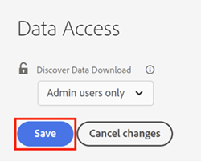

# [!UICONTROL Discover Data Download]存取控制 {#discover-data-download-access-control}

[!UICONTROL Discover Data Download]控制項可讓[!DNL Marketo Measure]管理員根據使用者的角色，設定Discover儀表板的資料下載原則。 控制項涵蓋Discover控制面板上的所有資料下載動作。

1. 按一下&#x200B;**[!UICONTROL Data Access]**&#x200B;下的[!UICONTROL Security]。

   

1. 按一下下拉式清單，然後為您的主控台選取適當的選項。

   

   <table>
    <tr>
     <td><strong>所有使用者</strong></td>
     <td>所有使用者都可以下載資料，包括PDF和CSV格式。</td>
    </tr>
    <tr>
     <td><strong>僅限管理員使用者</strong></td>
     <td>只有管理員使用者可以下載資料，包括PDF和CSV格式。</td>
    </tr>
    <tr>
     <td><strong>None</strong></td>
     <td>沒有人可以下載資料，包括PDF和CSV格式。</td>
    </tr>
   </table>

1. 完成時，按一下&#x200B;**[!UICONTROL Save]**。

   

>[!NOTE]
>
>此設定可能要在使用者登出再重新登入後才會生效。
